# 第1章 使用神经网络识别手写数字
The human visual system is one of the wonders of the world. Consider the following sequence of handwritten digits:

人类视觉系统是个奇迹。比如以下手写数字序列：


Most people effortlessly recognize those digits as 504192. That ease is deceptive. In each hemisphere of our brain, humans have a primary visual cortex, also known as V1, containing 140 million neurons, with tens of billions of connections between them. And yet human vision involves not just V1, but an entire series of visual cortices - V2, V3, V4, and V5 - doing progressively more complex image processing. We carry in our heads a supercomputer, tuned by evolution over hundreds of millions of years, and superbly adapted to understand the visual world. Recognizing handwritten digits isn't easy. Rather, we humans are stupendously, astoundingly good at making sense of what our eyes show us. But nearly all that work is done unconsciously. And so we don't usually appreciate how tough a problem our visual systems solve.

大多数人毫不费力地将这些数字识别为 504192 。其实这种容易具有欺骗性。在我们大脑的每个半球，都有一个初级视觉皮层 V1 ，其包含 1.4 亿个神经元，它们之间有数百亿个连接。然而，人类视觉不仅只有 V1 ，还涉及整个系列的视觉皮层- V2，V3，V4和V5 - 逐步进行更复杂的图像处理。我们的脑是一台超级计算机，经过数亿年的演变调整，已经非常适应理解视觉世界。识别手写数字并不容易。然而，我们人类是惊人的，非常善于理解眼睛向我们展示的东西。但几乎所有这些工作都是在无意识中完成的。因此，我们通常不会理解视觉系统解决问题的难度。

The difficulty of visual pattern recognition becomes apparent if you attempt to write a computer program to recognize digits like those above. What seems easy when we do it ourselves suddenly becomes extremely difficult. Simple intuitions about how we recognize shapes - "a 9 has a loop at the top, and a vertical stroke in the bottom right" - turn out to be not so simple to express algorithmically. When you try to make such rules precise, you quickly get lost in a morass of exceptions and caveats and special cases. It seems hopeless.

如果您尝试编写计算机程序来识别上述数字，那么视觉模式识别的难度就会变得很明显。当我们自己做看起来很容易的事件对机器会变得非常困难。关于我们如何识别形状的简单直觉 - “一个9在顶部有一个环，一个在右下方有一个垂直笔划” - 结果并不是那么简单用算法表达的。而当你试图使这些规则变得精确时，你很快就会陷入大量的异常和警告以及特殊情况。这似乎毫无希望。

Neural networks approach the problem in a different way. The idea is to take a large number of handwritten digits, known as training examples,

神经网络以不同的方式解决这个问题。想法是采用大量手写数字，称为*训练样例*，


and then develop a system which can learn from those training examples. In other words, the neural network uses the examples to automatically infer rules for recognizing handwritten digits. Furthermore, by increasing the number of training examples, the network can learn more about handwriting, and so improve its accuracy. So while I've shown just 100 training digits above, perhaps we could build a better handwriting recognizer by using thousands or even millions or billions of training examples.

然后开发一个可以从这些训练样例中学习的系统。换句话说，神经网络使用示例来自动推断用于识别手写数字的规则。此外，通过增加训练样本的数量，神经网络可以更多地了解手写，从而提高其准确性。因此，虽然我上面只显示了 100 个训练数字，但也许我们可以通过使用数千甚至数百万或数十亿的训练样例来构建更好的手写识别器。

In this chapter we'll write a computer program implementing a neural network that learns to recognize handwritten digits. The program is just 74 lines long, and uses no special neural network libraries. But this short program can recognize digits with an accuracy over 96 percent, without human intervention. Furthermore, in later chapters we'll develop ideas which can improve accuracy to over 99 percent. In fact, the best commercial neural networks are now so good that they are used by banks to process cheques, and by post offices to recognize addresses.

在本章中，我们将编写一个计算机程序，实现一个学习识别手写数字的神经网络。该程序只有 74 行代码，并没有使用特殊的神经网络库。但是这个简短的程序可以识别精度超过 96％ 的数字，而无需人工干预。此外，在后面的章节中，我们将提出可以将准确度提高到 99％ 以上的想法。实际上，最好的商业神经网络现在已经非常好用，银行可以使用它们来处理支票，并通过邮局来识别地址。

We're focusing on handwriting recognition because it's an excellent prototype problem for learning about neural networks in general. As a prototype it hits a sweet spot: it's challenging - it's no small feat to recognize handwritten digits - but it's not so difficult as to require an extremely complicated solution, or tremendous computational power. Furthermore, it's a great way to develop more advanced techniques, such as deep learning. And so throughout the book we'll return repeatedly to the problem of handwriting recognition. Later in the book, we'll discuss how these ideas may be applied to other problems in computer vision, and also in speech, natural language processing, and other domains.

我们专注于手写识别，因为它是学习神经网络的一个很好的原型问题。作为原型，它有一个最佳点：它具有挑战性 - 识别手写数字并不是一件小事 - 但要求极其复杂的解决方案或巨大的计算能力并不困难。此外，它是开发更高级技术的好方法，例如深度学习。因此，在整本书中，我们将反复回到手写识别问题。在本书的后面，我们将讨论这些想法如何应用于计算机视觉中的其他问题，以及语音，自然语言处理和其他领域。

Of course, if the point of the chapter was only to write a computer program to recognize handwritten digits, then the chapter would be much shorter! But along the way we'll develop many key ideas about neural networks, including two important types of artificial neuron (the perceptron and the sigmoid neuron), and the standard learning algorithm for neural networks, known as stochastic gradient descent. Throughout, I focus on explaining why things are done the way they are, and on building your neural networks intuition. That requires a lengthier discussion than if I just presented the basic mechanics of what's going on, but it's worth it for the deeper understanding you'll attain. Amongst the payoffs, by the end of the chapter we'll be in position to understand what deep learning is, and why it matters.

当然，如果本章的目的只是编写一个识别手写数字的计算机程序，那么这一章就会短得多！但在此过程中，我们将开发许多关于神经网络的关键思想，包括两种重要类型的人工神经元（感知器和 sigmoid 神经元），以及神经网络的标准学习算法，称为随机梯度下降。在整个过程中，我专注于解释为什么事情以他们的方式完成，以及建立你的神经网络直觉。这需要更长时间的讨论，而不是我刚刚介绍了正在发生的事情的基本机制，但是对于你将获得更深刻的理解是值得的。有所收益后，在本章结尾，我们将能够理解深度学习是什么。

## Perceptrons 感知器
What is a neural network? To get started, I'll explain a type of artificial neuron called a perceptron. Perceptrons were developed in the 1950s and 1960s by the scientist Frank Rosenblatt, inspired by earlier work by Warren McCulloch and Walter Pitts. Today, it's more common to use other models of artificial neurons - in this book, and in much modern work on neural networks, the main neuron model used is one called the sigmoid neuron. We'll get to sigmoid neurons shortly. But to understand why sigmoid neurons are defined the way they are, it's worth taking the time to first understand perceptrons.

`什么是神经网络？`首先，我将解释一种称为感知器的人工神经元。感知器是由科学家 弗兰克罗森布拉特 在 20世纪50年代和60年代 开发的 ，受到 沃伦麦卡洛克 和 沃尔特皮茨 的早期工作的启发。今天，使用其他模型的人工神经元更为常见 - 在本书中，在神经网络的许多现代工作中，使用的主要神经元模型是一个称为 S 形神经元的模型 。我们很快就会得到 sigmoid 神经​​元。但要理解为什么 sigmoid 神经元的定义方式如此，值得花时间先了解感知器。

So how do perceptrons work? A perceptron takes several binary inputs, x1,x2,…

`那么感知器如何工作呢？`感知器需要几个二进制输入 x1，x2，...，并生成一个二进制输出：


In the example shown the perceptron has three inputs, x1,x2,x3. In general it could have more or fewer inputs. Rosenblatt proposed a simple rule to compute the output. He introduced weights, w1,w2,…, real numbers expressing the importance of the respective inputs to the output. The neuron's output, 0 or 1, is determined by whether the weighted sum ∑w_jx_j is less than or greater than some threshold value. Just like the weights, the threshold is a real number which is a parameter of the neuron. To put it in more precise algebraic terms:

在所示的示例中，感知器有三个输入 x1，x2，x3 。一般来说，它可能有更多或更少的输入。罗森布拉特 提出了一个计算输出的简单规则。他介绍了*权重*，w1，w2，...，实数表示各输入对输出的重要性。神经元的输出，0或1，是由加权和 ∑w_jx_j 小于或大于某个阈值决定的。就像权重一样，阈值是一个实数，它是神经元的参数。用更精确的代数术语来表达它：

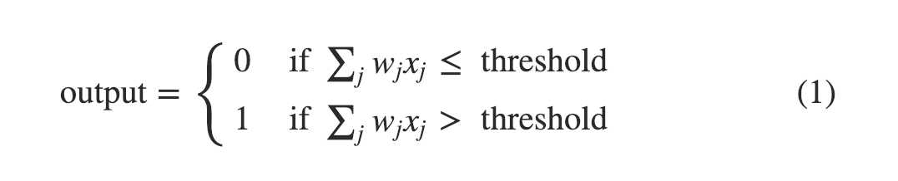

That's all there is to how a perceptron works!

这就是感知器的工作方式！

That's the basic mathematical model. A way you can think about the perceptron is that it's a device that makes decisions by weighing up evidence. Let me give an example. It's not a very realistic example, but it's easy to understand, and we'll soon get to more realistic examples. Suppose the weekend is coming up, and you've heard that there's going to be a cheese festival in your city. You like cheese, and are trying to decide whether or not to go to the festival. You might make your decision by weighing up three factors:

这是基本的数学模型。您可以考虑感知器的一种方式是，它是一种通过权衡证据来做出决策的设备。让我举个例子。这不是一个非常现实的例子，但它很容易理解，我们很快就会得到更实际的例子。假设周末即将来临，你已经听说你所在城市将举办奶酪节。你喜欢奶酪，并试图决定是否去参加奶酪节。您可以通过权衡三个因素来做出决定：

- Is the weather good?
- Does your boyfriend or girlfriend want to accompany you?
- Is the festival near public transit? (You don't own a car).

- 天气好吗？
- 你的男朋友或女朋友想陪你吗？
- 节日附近有公共交通吗？（你没有车）。

We can represent these three factors by corresponding binary variables x1,x2, and x3. For instance, we'd have x1=1 if the weather is good, and x1=0 if the weather is bad. Similarly, x2=1 if your boyfriend or girlfriend wants to go, and x2=0 if not. And similarly again for x3 and public transit.

我们可以通过相应的二元变量 x 来表示这三个因子 x1，x2和x3。例如，如果天气好的话 x1=1，如果天气不好 x1=0，同样，如果你的男朋友或女朋友想去 x2=1，否则 x2=0。公共交通类似。

Now, suppose you absolutely adore cheese, so much so that you're happy to go to the festival even if your boyfriend or girlfriend is uninterested and the festival is hard to get to. But perhaps you really loathe bad weather, and there's no way you'd go to the festival if the weather is bad. You can use perceptrons to model this kind of decision-making. One way to do this is to choose a weight w1=6 for the weather, and w2=2 and w3=2 for the other conditions. The larger value of w1 indicates that the weather matters a lot to you, much more than whether your boyfriend or girlfriend joins you, or the nearness of public transit. Finally, suppose you choose a threshold of 5 for the perceptron. With these choices, the perceptron implements the desired decision-making model, outputting 1 whenever the weather is good, and 0 whenever the weather is bad. It makes no difference to the output whether your boyfriend or girlfriend wants to go, or whether public transit is nearby.

现在，假设你非常喜欢奶酪，以至于即使你的男朋友或女朋友不感兴趣并且奶酪节难以到达，你也很高兴参加节日。但也许你真的厌恶恶劣的天气，如果天气不好，就没有办法去参加电影节。您可以使用感知器来模拟这种决策。一种方法是选择权重 w1=6，w2=2 和 w3=2。w1 的值越大表明天气对你很重要，远远超过你的男朋友或女朋友是否陪伴你，或者附近是否公共交通。最后，假设您选择的阈值为 5。通过这些选择，感知器实现了所需的决策模型，输出 1 天气好的时候，0 天气不好的时候。无论你的男朋友或女朋友想去，或公共交通是否在附近，输出都没有区别。

By varying the weights and the threshold, we can get different models of decision-making. For example, suppose we instead chose a threshold of 3. Then the perceptron would decide that you should go to the festival whenever the weather was good or when both the festival was near public transit and your boyfriend or girlfriend was willing to join you. In other words, it'd be a different model of decision-making. Dropping the threshold means you're more willing to go to the festival.

通过改变权重和阈值，我们可以得到不同的决策模型。例如，假设我们选择了阈值 3。然后感知器会决定你应该在天气好的时候去节日，或者当节日都在公共交通附近时，你的男朋友或女朋友愿意陪伴你。换句话说，它是一种不同的决策模型。降低阈值意味着你更愿意去参加电影节。

Obviously, the perceptron isn't a complete model of human decision-making! But what the example illustrates is how a perceptron can weigh up different kinds of evidence in order to make decisions. And it should seem plausible that a complex network of perceptrons could make quite subtle decisions:

显然，感知器并不是人类决策的完整模型！但这个例子说明了感知器如何权衡不同类型的证据以便做出决策。一个复杂的感知器网络可以做出非常微妙的决定，这似乎是合理的：


In this network, the first column of perceptrons - what we'll call the first layer of perceptrons - is making three very simple decisions, by weighing the input evidence. What about the perceptrons in the second layer? Each of those perceptrons is making a decision by weighing up the results from the first layer of decision-making. In this way a perceptron in the second layer can make a decision at a more complex and more abstract level than perceptrons in the first layer. And even more complex decisions can be made by the perceptron in the third layer. In this way, a many-layer network of perceptrons can engage in sophisticated decision making.

在这个网络中，第一列感知器 - 我们称之为第一层感知器 - 通过权衡输入做出三个非常简单的决定。第二层的感知器呢？每个感知者都通过权衡第一层决策的结果来做出决定。通过这种方式，第二层中的感知器可以在比第一层中的感知器更复杂和更抽象的水平上做出决定。而第三层中的感知器可以做出更复杂的决策。通过这种方式，感知器的多层网络可以参与复杂的决策制定。

Incidentally, when I defined perceptrons I said that a perceptron has just a single output. In the network above the perceptrons look like they have multiple outputs. In fact, they're still single output. The multiple output arrows are merely a useful way of indicating that the output from a perceptron is being used as the input to several other perceptrons. It's less unwieldy than drawing a single output line which then splits.

顺便说一下，当我定义感知器时，我说感知器只有一个输出。在上面的网络中，感知器看起来像有多个输出。事实上，它们仍然是单一输出。多个输出箭头仅仅是指示感知器的输出被用作若干其他感知器的输入的有用方式。它比绘制单个输出线然后分裂更好。

Let's simplify the way we describe perceptrons. The condition ∑w_jx_j>threshold is cumbersome, and we can make two notational changes to simplify it. The first change is to write ∑w_jx_j as a dot product, w⋅x≡∑w_jx_j, where w and x are vectors whose components are the weights and inputs, respectively. The second change is to move the threshold to the other side of the inequality, and to replace it by what's known as the perceptron's bias, b≡−threshold. Using the bias instead of the threshold, the perceptron rule can be rewritten:

让我们简化描述感知器的方式。条件 ∑w_jx_j>threshold 很麻烦，我们可以做两个符号更改来简化它。第一个变化是写 ∑w_jx_j 作为点积， w⋅x≡∑w_jx_j ，这里w和x是分量为权重和输入的向量。第二个变化是 threshold 移动到不等式的另一边，并通过了所谓的感知的来取代它偏见，b≡−threshold。使用偏差而不是阈值，可以重写感知器规则：

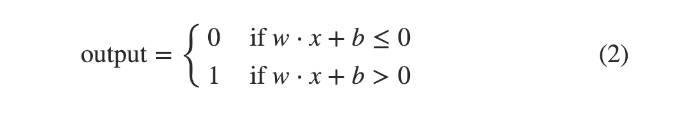

You can think of the bias as a measure of how easy it is to get the perceptron to output a 1. Or to put it in more biological terms, the bias is a measure of how easy it is to get the perceptron to fire. For a perceptron with a really big bias, it's extremely easy for the perceptron to output a 1. But if the bias is very negative, then it's difficult for the perceptron to output a 1. Obviously, introducing the bias is only a small change in how we describe perceptrons, but we'll see later that it leads to further notational simplifications. Because of this, in the remainder of the book we won't use the threshold, we'll always use the bias.

您可以将偏差视为衡量感知器输出1的容易程度的指标。或者用更生物学的术语来说，偏见是衡量感知器工作的容易程度 。对于具有非常大的偏差的感知器，感知器输出1非常容易。但如果偏差非常消极，那么感知器很难输出1。显然，引入偏差只是我们描述感知器的方式的一个小变化，但我们稍后会看到它导致进一步的符号简化。因此，在本书的其余部分我们将不会使用 threshold，我们将始终使用偏差。

I've described perceptrons as a method for weighing evidence to make decisions. Another way perceptrons can be used is to compute the elementary logical functions we usually think of as underlying computation, functions such as AND, OR, and NAND. For example, suppose we have a perceptron with two inputs, each with weight −2, and an overall bias of 3. Here's our perceptron:

我已经将感知器描述为衡量证据以做出决策的方法。感知器可以使用的另一种方法是计算的基本逻辑功能我们通常认为作为基础计算的，功能，如AND，OR和 NAND。例如，假设我们有一个具有两个输入的感知器，每个输入具有权重 -2，总体偏差为 3。这是我们的感知器：


Then we see that input 00 produces output 1, since (−2)*0+(−2)*0+3=3 is positive. Here, I've introduced the ∗ symbol to make the multiplications explicit. Similar calculations show that the inputs 01 and 10 produce output 1. But the input 11 produces output 0, since (−2)*1+(−2)*1+3=−1 is negative. And so our perceptron implements a NAND gate!

然后我们看到输入 00 产生输出 1，因为 (−2)*0+(−2)*0+3=3 是正的。在这里，我介绍了 * 使乘法显式的符号。类似的计算表明输入 01和10产生输出1。但输入 11产生输出0，因为 (−2)*1+(−2)*1+3=−1 是负的。所以我们的感知器实现了一个 NAND 门！

The NAND example shows that we can use perceptrons to compute simple logical functions. In fact, we can use networks of perceptrons to compute any logical function at all. The reason is that the NAND gate is universal for computation, that is, we can build any computation up out of NAND gates. For example, we can use NAND gates to build a circuit which adds two bits, x1 and x2. This requires computing the bitwise sum, x1⊕x2, as well as a carry bit which is set to 1 when both x1 and x2 are 1, i.e., the carry bit is just the bitwise product x1x2:

该 NAN D示例表明我们可以使用感知器来计算简单的逻辑函数。实际上，我们可以使用感知器网络来计算任何逻辑功能。原因是 NAND 门是通用的计算，也就是说，我们可以在 NAND 门外建立任何计算 。例如，我们可以使用 NAND 门来构建一个增加两位的电路 x1和x2。这需要计算按位和x1⊕x2，以及当 x1和x2都是1 时设置为1的进位，即，进位只是按位乘积 x1X2：


To get an equivalent network of perceptrons we replace all the NAND gates by perceptrons with two inputs, each with weight −2, and an overall bias of 3. Here's the resulting network. Note that I've moved the perceptron corresponding to the bottom right NAND gate a little, just to make it easier to draw the arrows on the diagram:

为了得到感知的等效网络，我们全部更换为 NAND 具有两个输入，每重门通过感知 -2，总体偏差为 3。这是最终的网络。请注意，我已经将感知器对应于右下方的 NAND 门稍微移动了一下，只是为了更容易在图上绘制箭头：


One notable aspect of this network of perceptrons is that the output from the leftmost perceptron is used twice as input to the bottommost perceptron. When I defined the perceptron model I didn't say whether this kind of double-output-to-the-same-place was allowed. Actually, it doesn't much matter. If we don't want to allow this kind of thing, then it's possible to simply merge the two lines, into a single connection with a weight of -4 instead of two connections with -2 weights. (If you don't find this obvious, you should stop and prove to yourself that this is equivalent.) With that change, the network looks as follows, with all unmarked weights equal to -2, all biases equal to 3, and a single weight of -4, as marked:

这种感知器网络的一个值得注意的方面是，最左边的感知器的输出被用作最底部感知器的两倍输入。当我定义感知器模型时，我没有说明是否允许这种双输出到同一个地方。实际上，它并不重要。如果我们不想允许这种事情，那么可以简单地将两条线合并为一个权重为-4的单个连接，而不是两个具有-2个权重的连接。（如果你没有发现这一点，你应该停下来向自己证明这是等价的。）通过这种改变，网络看起来如下，所有未标记的权重等于-2，所有偏差等于3，和一个权重-4，标记为：


Up to now I've been drawing inputs like x1 and x2 as variables floating to the left of the network of perceptrons. In fact, it's conventional to draw an extra layer of perceptrons - the input layer - to encode the inputs:

到目前为止，我一直在绘制像 x1和x2 这样的输入作为浮动到感知器网络左侧的变量。事实上，传统的做法是绘制一层额外的感知器 - 输入层 - 来编码输入：


This notation for input perceptrons, in which we have an output, but no inputs,

输入感知器的这种表示法，我们有输出，但没有输入，


is a shorthand. It doesn't actually mean a perceptron with no inputs. To see this, suppose we did have a perceptron with no inputs. Then the weighted sum ∑w_jx_j would always be zero, and so the perceptron would output 1 if b>0, and 0 if b≤0. That is, the perceptron would simply output a fixed value, not the desired value (x1, in the example above). It's better to think of the input perceptrons as not really being perceptrons at all, but rather special units which are simply defined to output the desired values, x1,x2,….

是一种简写。它实际上并不意味着感知器是没有输入的。为了说明这一点，假设我们确实有一个没有输入的感知器。然后是加权和 ∑w_jx_j 永远是零，所以如果b>0感知器会输出1，如果b≤0感知器会输出0。也就是说，感知器只会输出一个固定值，而不是所需的值（x1，在上面的例子中）。最好将输入感知器视为根本不是真正的感知器，而是将特殊单元简单地定义为输出所需的值， x1，x2，...。

The adder example demonstrates how a network of perceptrons can be used to simulate a circuit containing many NAND gates. And because NAND gates are universal for computation, it follows that perceptrons are also universal for computation.

加法器示例演示了如何使用感知器网络来模拟包含许多NAND门的电路。并且由于NAND门是计算的通用门，因此感知器也是计算的通用门。

The computational universality of perceptrons is simultaneously reassuring and disappointing. It's reassuring because it tells us that networks of perceptrons can be as powerful as any other computing device. But it's also disappointing, because it makes it seem as though perceptrons are merely a new type of NAND gate. That's hardly big news!

感知器的计算普遍性同时令人放心和令人失望。它令人放心，因为它告诉我们感知器网络可以像任何其他计算设备一样强大。但它也令人失望，因为它看起来好像感知器只是一种新型的NAND门。这不是什么大新闻！

However, the situation is better than this view suggests. It turns out that we can devise learning algorithms which can automatically tune the weights and biases of a network of artificial neurons. This tuning happens in response to external stimuli, without direct intervention by a programmer. These learning algorithms enable us to use artificial neurons in a way which is radically different to conventional logic gates. Instead of explicitly laying out a circuit of NAND and other gates, our neural networks can simply learn to solve problems, sometimes problems where it would be extremely difficult to directly design a conventional circuit.

但是，情况比这个观点所暗示的要好。事实证明，我们可以设计学习算法，可以自动调整人工神经元网络的权重和偏差。这种调整是在响应外部刺激时发生的，没有程序员的直接干预。这些学习算法使我们能够以与传统逻辑门完全不同的方式使用人工神经元。NAND我们的神经网络可以简单地学习解决问题，而不是明确地布置电路和其他门，而不是直接设计传统电路的问题。

## Sigmoid neurons Sigmoid神经​​元
Learning algorithms sound terrific. But how can we devise such algorithms for a neural network? Suppose we have a network of perceptrons that we'd like to use to learn to solve some problem. For example, the inputs to the network might be the raw pixel data from a scanned, handwritten image of a digit. And we'd like the network to learn weights and biases so that the output from the network correctly classifies the digit. To see how learning might work, suppose we make a small change in some weight (or bias) in the network. What we'd like is for this small change in weight to cause only a small corresponding change in the output from the network. As we'll see in a moment, this property will make learning possible. Schematically, here's what we want (obviously this network is too simple to do handwriting recognition!):

学习算法听起来很棒。但是我们如何为神经网络设计这样的算法呢？假设我们有一个感知器网络，我们想用它来学习解决一些问题。例如，网络的输入可以是来自扫描的手写的数字图像的原始像素数据。我们希望网络能够学习权重和偏差，以便网络输出正确地对数字进行分类。要了解学习如何发挥作用，假设我们对网络中的某些权重（或偏见）进行了微小的改变。我们所希望的是，这种小的重量变化只会导致网络输出的相应变化很小。正如我们稍后将看到的，这个属性将使学习成为可能。原理上，这就是我们想要的（显然这个网络太简单了，无法进行手写识别！）：


If it were true that a small change in a weight (or bias) causes only a small change in output, then we could use this fact to modify the weights and biases to get our network to behave more in the manner we want. For example, suppose the network was mistakenly classifying an image as an "8" when it should be a "9". We could figure out how to make a small change in the weights and biases so the network gets a little closer to classifying the image as a "9". And then we'd repeat this, changing the weights and biases over and over to produce better and better output. The network would be learning.

如果权重（或偏差）的微小变化确实导致输出的变化很小，那么我们可以使用这个事实来修改权重和偏差，以使我们的网络以我们想要的方式表现得更好。例如，假设当网络应该是“9”时，网络错误地将图像分类为“8”。我们可以弄清楚如何对权重和偏差进行微小的改变，以便网络更接近将图像分类为“9”。然后我们重复这一点，一遍又一遍地改变权重和偏差，以产生更好和更好的输出。网络将是学习。

The problem is that this isn't what happens when our network contains perceptrons. In fact, a small change in the weights or bias of any single perceptron in the network can sometimes cause the output of that perceptron to completely flip, say from 0 to 1. That flip may then cause the behaviour of the rest of the network to completely change in some very complicated way. So while your "9" might now be classified correctly, the behaviour of the network on all the other images is likely to have completely changed in some hard-to-control way. That makes it difficult to see how to gradually modify the weights and biases so that the network gets closer to the desired behaviour. Perhaps there's some clever way of getting around this problem. But it's not immediately obvious how we can get a network of perceptrons to learn.

问题是当我们的网络包含感知器时，这不会发生。实际上，网络中任何单个感知器的权重或偏差的微小变化有时会导致该感知器的输出完全翻转，比如0到1。然后，该翻转可能导致网络其余部分的行为以某种非常复杂的方式完全改变。因此，虽然您的“9”现在可能被正确分类，但网络在所有其他图像上的行为可能会以某种难以控制的方式完全改变。这使得很难看到如何逐渐修改权重和偏差，以使网络更接近所需的行为。也许有一些聪明的方法可以解决这个问题。但我们如何才能获得感知器网络才能学习，这并不是显而易见的。

We can overcome this problem by introducing a new type of artificial neuron called a sigmoid neuron. Sigmoid neurons are similar to perceptrons, but modified so that small changes in their weights and bias cause only a small change in their output. That's the crucial fact which will allow a network of sigmoid neurons to learn.

我们可以通过引入一种叫做S形神经元的新型人工神经元来克服这个问题。Sigmoid神经​​元类似于感知器，但经过修改，其重量和偏差的微小变化仅导致其输出的微小变化。这是允许乙状结肠神经元网络学习的关键事实。

Okay, let me describe the sigmoid neuron. We'll depict sigmoid neurons in the same way we depicted perceptrons:

好吧，让我来描述一下乙状结肠神经元。我们将以描述感知器的方式描绘乙状结肠神经元：


Just like a perceptron, the sigmoid neuron has inputs, x1,x2,…. But instead of being just 0 or 1, these inputs can also take on any values between 0 and 1. So, for instance, 0.638… is a valid input for a sigmoid neuron. Also just like a perceptron, the sigmoid neuron has weights for each input, w1,w2,…, and an overall bias, b. But the output is not 0 or 1. Instead, it's σ(w⋅x+b), where σ is called the sigmoid function, and is defined by:

就像感知器一样，S形神经元有输入x1，x2，...。但不是只有0或1，这些输入也可以采用0之间的 任何值和1。那么，例如， 0.638 ......是S形神经元的有效输入。同样就像感知器一样，S形神经元对每个输入都有权重w1，w2，...和整体偏见，b。但输出不是0或1。相反，它是σ（w ^ ⋅ X+ b ），其中σ被称为 sigmoid函数，并定义为：

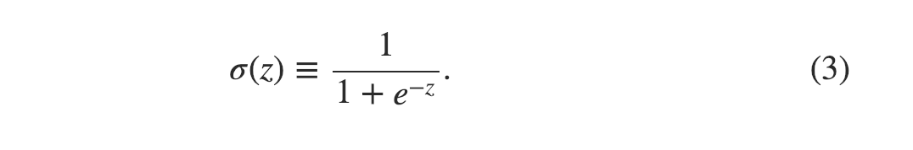

To put it all a little more explicitly, the output of a sigmoid neuron with inputs x1,x2,…, weights w1,w2,…, and bias b is

更明确地说，输入x的sigmoid神经​​元的输出1，x2，...，重量w1，w2，...和偏见b 是

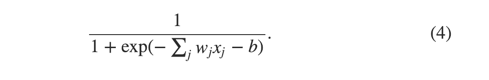

At first sight, sigmoid neurons appear very different to perceptrons. The algebraic form of the sigmoid function may seem opaque and forbidding if you're not already familiar with it. In fact, there are many similarities between perceptrons and sigmoid neurons, and the algebraic form of the sigmoid function turns out to be more of a technical detail than a true barrier to understanding.

乍一看，乙状结肠神经元看起来与感知器非常不同。如果您还不熟悉S形函数的代数形式可能看起来不透明和禁止。事实上，感知器和乙状结肠神经元之间存在许多相似之处，而S形函数的代数形式更多地是技术细节，而不是理解的真正障碍。

To understand the similarity to the perceptron model, suppose z≡w⋅x+b is a large positive number. Then e−z≈0 and so σ(z)≈1. In other words, when z=w⋅x+b is large and positive, the output from the sigmoid neuron is approximately 1, just as it would have been for a perceptron. Suppose on the other hand that z=w⋅x+b is very negative. Then e−z→∞, and σ(z)≈0. So when z=w⋅x+b is very negative, the behaviour of a sigmoid neuron also closely approximates a perceptron. It's only when w⋅x+b is of modest size that there's much deviation from the perceptron model.

要理解相似的感知模型，假设Z ^ ≡ W¯¯ ⋅ X+ b是一个很大的正数。然后e- z≈ 0所以σ（Ž ）≈ 1。换句话说，当z = w · x时+ b大而正，乙状结肠神经元的输出约为1就像感知器一样。另一方面，假设z = w · x+ b是非常消极的。然后e- z→ ∞，和σ（Ž ）≈ 0。所以，当 Z ^ = w ^ ⋅ X+ b非常消极，乙状结肠神经元的行为也非常接近感知器。只有当w ^ ⋅ X+ b 尺寸适中，与感知器模型有很大偏差。

What about the algebraic form of σ? How can we understand that? In fact, the exact form of σ isn't so important - what really matters is the shape of the function when plotted. Here's the shape:

σ的代数形式怎么样？？我们怎么能理解这个？实际上，σ的确切形式并不是那么重要 - 真正重要的是绘制时函数的形状。这是形状：


This shape is a smoothed out version of a step function:

此形状是阶梯函数的平滑版本：

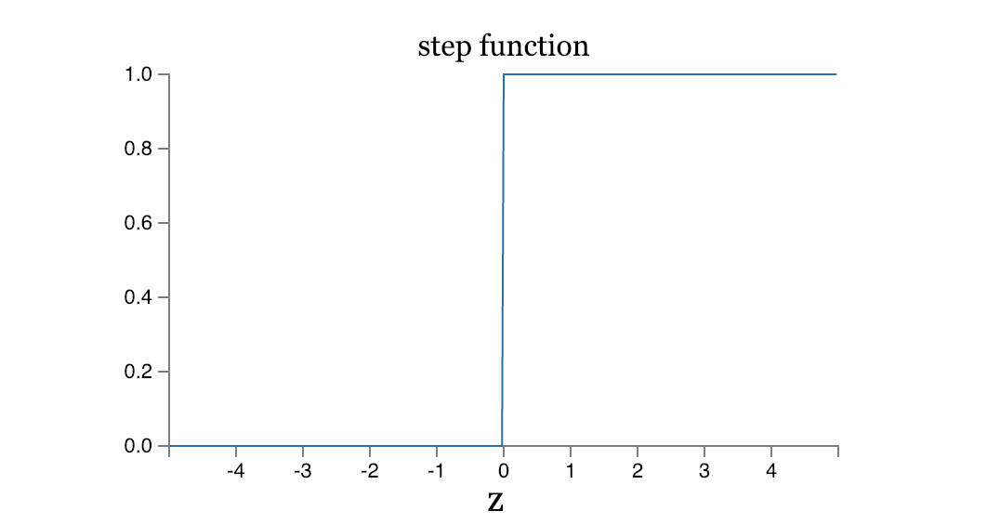

If σ had in fact been a step function, then the sigmoid neuron would be a perceptron, since the output would be 1 or 0 depending on whether w⋅x+b was positive or negative.By using the actual σ function we get, as already implied above, a smoothed out perceptron. Indeed, it's the smoothness of the σ function that is the crucial fact, not its detailed form. The smoothness of σ means that small changes Δwj in the weights and Δb in the bias will produce a small change Δoutput in the output from the neuron. In fact, calculus tells us that Δoutput is well approximated by

如果是σ实际上是一个阶梯函数，然后S形神经元将是一个感知器，因为输出将是1或0 这取决于是否W¯¯ ⋅ X+ b是正面或负面.通过使用实际σ我们得到的函数，如上所述，是一个平滑的感知器。实际上，它是σ的平滑度功能是关键的事实，而不是它的详细形式。σ的平滑度意味着小的变化Δ 瓦特Ĵ在权重和Δ b在偏置时会产生很小的变化Δ 输出在神经元的输出中。实际上，微积分告诉我们Δ 输出 很接近


where the sum is over all the weights, wj, and ∂output/∂wj and ∂output/∂b denote partial derivatives of the output with respect to wj and b, respectively. Don't panic if you're not comfortable with partial derivatives! While the expression above looks complicated, with all the partial derivatives, it's actually saying something very simple (and which is very good news): Δoutput is a linear function of the changes Δwj and Δb in the weights and bias. This linearity makes it easy to choose small changes in the weights and biases to achieve any desired small change in the output. So while sigmoid neurons have much of the same qualitative behaviour as perceptrons, they make it much easier to figure out how changing the weights and biases will change the output.

总和超过所有权重，wĴ，和∂输出/ ∂ w ^Ĵ和∂输出/ ∂b表示输出的偏导数关于 wĴ和b， 分别。如果你对偏导数不满意，不要惊慌！虽然上面的表达看起来很复杂，但是所有的偏导数实际上都说了一些非常简单的东西（这是非常好的消息）：Δ 输出是一个线性函数的变化Δ 瓦特Ĵ 和Δ b在权重和偏见。这种线性度使得可以轻松选择重量和偏差的微小变化，以实现输出中任何所需的小变化。因此，虽然乙状结肠神经元具有与感知器相同的定性行为，但它们使得更容易弄清楚如何改变重量和偏差将改变输出。

If it's the shape of σ which really matters, and not its exact form, then why use the particular form used for σ in Equation (3)? In fact, later in the book we will occasionally consider neurons where the output is f(w⋅x+b) for some other activation function f(⋅). The main thing that changes when we use a different activation function is that the particular values for the partial derivatives in Equation (5) change. It turns out that when we compute those partial derivatives later, using σ will simplify the algebra, simply because exponentials have lovely properties when differentiated. In any case, σ is commonly-used in work on neural nets, and is the activation function we'll use most often in this book.

如果它是σ的形状这真的很重要，而不是它的确切形式，那么为什么要使用σ的特定形式在等式（3）中？实际上，在本书后面我们偶尔会考虑输出为f的神经元（w ^ ⋅ X+ b ） 对于其他一些激活函数 f（⋅ ）。当我们使用不同的激活函数时，主要的变化是等式（5）中的偏导数的特定值改变。事实证明，当我们稍后使用σ计算这些偏导数时将简化代数，因为指数在区分时具有可爱的属性。无论如何，σ 常用于神经网络的工作，是我们在本书中最常使用的激活函数。

How should we interpret the output from a sigmoid neuron? Obviously, one big difference between perceptrons and sigmoid neurons is that sigmoid neurons don't just output 0 or 1. They can have as output any real number between 0 and 1, so values such as 0.173… and 0.689… are legitimate outputs. This can be useful, for example, if we want to use the output value to represent the average intensity of the pixels in an image input to a neural network. But sometimes it can be a nuisance. Suppose we want the output from the network to indicate either "the input image is a 9" or "the input image is not a 9". Obviously, it'd be easiest to do this if the output was a 0 or a 1, as in a perceptron. But in practice we can set up a convention to deal with this, for example, by deciding to interpret any output of at least 0.5 as indicating a "9", and any output less than 0.5 as indicating "not a 9". I'll always explicitly state when we're using such a convention, so it shouldn't cause any confusion.

我们应该如何解释乙状结肠神经元的输出？显然，感知器和乙状结肠神经元之间的一个很大区别是，乙状结肠神经元不仅仅输出0或1。它们可以在0之间输出任何实数和1，所以0.173等值...... 和0.689 ......是合法的产出。例如，如果我们想要使用输出值来表示输入到神经网络的图像中的像素的平均强度，则这可能是有用的。但有时它可能会令人讨厌。假设我们希望网络输出指示“输入图像是9”或“输入图像不是9”。显然，如果输出为0，最简单的方法就是这样做或1，就像感知器一样。但在实践中，我们可以建立一个约定来处理这个问题，例如，决定解释任何至少0.5的输出表示“9”，任何小于0.5的输出表示“不是9”。我总是明确说明我们何时使用这样的约定，所以它不应该引起任何混淆。

## The architecture of neural networks 神经网络的体系结构
In the next section I'll introduce a neural network that can do a pretty good job classifying handwritten digits. In preparation for that, it helps to explain some terminology that lets us name different parts of a network. Suppose we have the network:

在下一节中，我将介绍一个神经网络，它可以很好地分类手写数字。为此做准备，有助于解释一些术语，这些术语可以让我们为网络的不同部分命名。假设我们有网络：


As mentioned earlier, the leftmost layer in this network is called the input layer, and the neurons within the layer are called input neurons. The rightmost or output layer contains the output neurons, or, as in this case, a single output neuron. The middle layer is called a hidden layer, since the neurons in this layer are neither inputs nor outputs. The term "hidden" perhaps sounds a little mysterious - the first time I heard the term I thought it must have some deep philosophical or mathematical significance - but it really means nothing more than "not an input or an output". The network above has just a single hidden layer, but some networks have multiple hidden layers. For example, the following four-layer network has two hidden layers:

如前所述，该网络中最左边的层称为输入层，层内的神经元称为输入神经元。最右边或输出层包含输出神经元，或者在这种情况下，包含单个输出神经元。中间层称为 隐藏层因为这层神经元既不是输入也不是输出。“隐藏”一词可能听起来有点神秘 - 我第一次听到这个词时我认为它必须具有一些深刻的哲学或数学意义 - 但它实际上只不过是“不是输入或输出”。上面的网络只有一个隐藏层，但有些网络有多个隐藏层。例如，以下四层网络有两个隐藏层：


Somewhat confusingly, and for historical reasons, such multiple layer networks are sometimes called multilayer perceptrons or MLPs, despite being made up of sigmoid neurons, not perceptrons. I'm not going to use the MLP terminology in this book, since I think it's confusing, but wanted to warn you of its existence.

有些令人困惑，并且由于历史原因，这种多层网络有时被称为多层感知器或 MLP，尽管它们由乙状结肠神经元组成，而不是感知器。我不打算在本书中使用MLP术语，因为我觉得它很混乱，但是想要警告你它的存在。

The design of the input and output layers in a network is often straightforward. For example, suppose we're trying to determine whether a handwritten image depicts a "9" or not. A natural way to design the network is to encode the intensities of the image pixels into the input neurons. If the image is a 64 by 64 greyscale image, then we'd have 4,096=64×64 input neurons, with the intensities scaled appropriately between 0 and 1. The output layer will contain just a single neuron, with output values of less than 0.5 indicating "input image is not a 9", and values greater than 0.5 indicating "input image is a 9 ".

网络中输入和输出层的设计通常很简单。例如，假设我们试图确定手写图像是否描绘为“9”。设计网络的一种自然方式是将图像像素的强度编码到输入神经元中。如果图像是64到64岁灰度图像，然后我们就会有4 ，096 = 64 × 64输入神经元，强度在0之间适当缩放和1。输出层只包含一个神经元，输出值小于0.5表示“输入图像不是9”，值大于0.5 表示“输入图像是9”。

While the design of the input and output layers of a neural network is often straightforward, there can be quite an art to the design of the hidden layers. In particular, it's not possible to sum up the design process for the hidden layers with a few simple rules of thumb. Instead, neural networks researchers have developed many design heuristics for the hidden layers, which help people get the behaviour they want out of their nets. For example, such heuristics can be used to help determine how to trade off the number of hidden layers against the time required to train the network. We'll meet several such design heuristics later in this book.

虽然神经网络的输入和输出层的设计通常是直截了当的，但隐藏层的设计可能是相当有意义的。特别是，用一些简单的经验法则来概括隐藏层的设计过程是不可能的。相反，神经网络研究人员为隐藏层开发了许多设计启发式方法，帮助人们从网络中获得他们想要的行为。例如，这种启发式方法可用于帮助确定如何根据训练网络所需的时间来交换隐藏层的数量。我们将在本书后面讨论几种这样的设计启发式方法。

Up to now, we've been discussing neural networks where the output from one layer is used as input to the next layer. Such networks are called feedforward neural networks. This means there are no loops in the network - information is always fed forward, never fed back. If we did have loops, we'd end up with situations where the input to the σ function depended on the output. That'd be hard to make sense of, and so we don't allow such loops.

到目前为止，我们一直在讨论神经网络，其中一层的输出用作下一层的输入。这种网络称为前馈 神经网络。这意味着网络中没有环路 - 信息总是向前馈送，从不反馈。如果我们确实有循环，我们最终会得到输入到σ的情况 功能取决于输出。这很难理解，因此我们不允许这样的循环。

However, there are other models of artificial neural networks in which feedback loops are possible. These models are called recurrent neural networks. The idea in these models is to have neurons which fire for some limited duration of time, before becoming quiescent. That firing can stimulate other neurons, which may fire a little while later, also for a limited duration. That causes still more neurons to fire, and so over time we get a cascade of neurons firing. Loops don't cause problems in such a model, since a neuron's output only affects its input at some later time, not instantaneously.

然而，还有其他模型的人工神经网络，其中反馈回路是可能的。这些模型称为 循环神经网络。这些模型中的想法是让神经元在变为静止之前在一段有限的时间内激发。这种射击可以刺激其他神经元，这些神经元可能会在一段时间内发射，也会持续一段时间。这导致更多的神经元发射，因此随着时间的推移，我们会得到一连串的神经元射击。循环不会在这样的模型中引起问题，因为神经元的输出仅在稍后的某个时间影响其输入，而不是瞬间。

Recurrent neural nets have been less influential than feedforward networks, in part because the learning algorithms for recurrent nets are (at least to date) less powerful. But recurrent networks are still extremely interesting. They're much closer in spirit to how our brains work than feedforward networks. And it's possible that recurrent networks can solve important problems which can only be solved with great difficulty by feedforward networks. However, to limit our scope, in this book we're going to concentrate on the more widely-used feedforward networks.

递归神经网络比前馈网络的影响力小，部分原因是复发网络的学习算法（至少到目前为止）不那么强大。但经常性的网络仍然非常有趣。他们在精神上比我们的大脑更接近前馈网络。并且循环网络可以解决重要问题，这些问题只能通过前馈网络很难解决。但是，为了限制我们的范围，在本书中我们将专注于更广泛使用的前馈网络。

## A simple network to classify handwritten digits 一个简单的网络，用于对手写数字进行分类
Having defined neural networks, let's return to handwriting recognition. We can split the problem of recognizing handwritten digits into two sub-problems. First, we'd like a way of breaking an image containing many digits into a sequence of separate images, each containing a single digit. For example, we'd like to break the image

定义了神经网络后，让我们回到手写识别。我们可以将识别手写数字的问题分成两个子问题。首先，我们想要一种将包含许多数字的图像分成一系列单独图像的方法，每个图像包含一个数字。例如，我们想打破图像


into six separate images,

分为六个单独的图像，


We humans solve this segmentation problem with ease, but it's challenging for a computer program to correctly break up the image. Once the image has been segmented, the program then needs to classify each individual digit. So, for instance, we'd like our program to recognize that the first digit above,

我们人类轻松地解决了这个分割问题，但是计算机程序正确分解图像具有挑战性。一旦图像被分割，程序就需要对每个数字进行分类。所以，例如，我们希望我们的程序识别出上面的第一个数字，


is a 5.

是5。

We'll focus on writing a program to solve the second problem, that is, classifying individual digits. We do this because it turns out that the segmentation problem is not so difficult to solve, once you have a good way of classifying individual digits. There are many approaches to solving the segmentation problem. One approach is to trial many different ways of segmenting the image, using the individual digit classifier to score each trial segmentation. A trial segmentation gets a high score if the individual digit classifier is confident of its classification in all segments, and a low score if the classifier is having a lot of trouble in one or more segments. The idea is that if the classifier is having trouble somewhere, then it's probably having trouble because the segmentation has been chosen incorrectly. This idea and other variations can be used to solve the segmentation problem quite well. So instead of worrying about segmentation we'll concentrate on developing a neural network which can solve the more interesting and difficult problem, namely, recognizing individual handwritten digits.

我们将专注于编写程序来解决第二个问题，即对个别数字进行分类。我们这样做是因为事实证明，一旦你有一个很好的方法来分类个别数字，分割问题就不那么难解决了。有许多方法可以解决分割问题。一种方法是尝试许多不同的分割图像的方法，使用单个数字分类器对每个试验分割进行评分。如果单个数字分类器对所有片段中的分类充满信心，则试验分段获得高分，如果分类器在一个或多个片段中具有很多麻烦，则分数得分较低。这个想法是，如果分类器在某处遇到麻烦，那么它可能会遇到麻烦，因为分段选择不正确。这个想法和其他变化可以用于很好地解决分割问题。因此，我们不会担心细分，而是专注于开发一个神经网络，它可以解决更有趣和更困难的问题，即识别单个手写数字。

To recognize individual digits we will use a three-layer neural network:

为了识别个别数字，我们将使用三层神经网络：


The input layer of the network contains neurons encoding the values of the input pixels. As discussed in the next section, our training data for the network will consist of many 28 by 28 pixel images of scanned handwritten digits, and so the input layer contains 784=28×28 neurons. For simplicity I've omitted most of the 784 input neurons in the diagram above. The input pixels are greyscale, with a value of 0.0 representing white, a value of 1.0 representing black, and in between values representing gradually darkening shades of grey.

网络的输入层包含编码输入像素值的神经元。如下一节所述，我们的网络培训数据将包含28个到了28扫描的手写数字的像素图像，因此输入层包含784 = 28 × 28神经元。为简单起见，我省略了784的大部分内容 输入神经元在上图中。输入像素为灰度，值为0.0代表白色，值为1.0 表示黑色，以及表示逐渐变暗的灰色阴影的值。

The second layer of the network is a hidden layer. We denote the number of neurons in this hidden layer by n, and we'll experiment with different values for n. The example shown illustrates a small hidden layer, containing just n=15 neurons.

网络的第二层是隐藏层。我们用n表示这个隐藏层中的神经元数量，我们将尝试不同的n值。显示的示例说明了一个小的隐藏层，仅包含n = 15 神经元。

The output layer of the network contains 10 neurons. If the first neuron fires, i.e., has an output ≈1, then that will indicate that the network thinks the digit is a 0. If the second neuron fires then that will indicate that the network thinks the digit is a 1. And so on. A little more precisely, we number the output neurons from 0 through 9, and figure out which neuron has the highest activation value. If that neuron is, say, neuron number 6, then our network will guess that the input digit was a 6. And so on for the other output neurons.

网络的输出层包含10个神经元。如果第一神经元激发的，即，有一个输出≈ 1，那表明网络认为数字为0。如果第二个神经元触发，则表明网络认为该数字为 1。等等。更准确地说，我们将输出神经元从0编号通过9，并找出哪个神经元具有最高的激活值。如果那个神经元是神经元数6，那么我们的网络将猜测输入数字为6。等等其他输出神经元。

You might wonder why we use 10 output neurons. After all, the goal of the network is to tell us which digit (0,1,2,…,9) corresponds to the input image. A seemingly natural way of doing that is to use just 4 output neurons, treating each neuron as taking on a binary value, depending on whether the neuron's output is closer to 0 or to 1. Four neurons are enough to encode the answer, since 24=16 is more than the 10 possible values for the input digit. Why should our network use 10 neurons instead? Isn't that inefficient? The ultimate justification is empirical: we can try out both network designs, and it turns out that, for this particular problem, the network with 10 output neurons learns to recognize digits better than the network with 4 output neurons. But that leaves us wondering why using 10 output neurons works better. Is there some heuristic that would tell us in advance that we should use the 10-output encoding instead of the 4-output encoding?

你可能想知道为什么我们使用10输出神经元。毕竟，网络的目标是要告诉我们哪些数字（0 ，1 ，2 ，... ，9）对应于输入图像。看似自然的方式是使用4输出神经元，将每个神经元视为二进制值，取决于神经元的输出是否接近 0或者1。从2开始，四个神经元足以编码答案 4= 16超过输入数字的10个可能值。我们的网络为何要使用10神经元呢？那不是很低效吗？最终的理由是经验性的：我们可以尝试两种网络设计，事实证明，对于这个特定的问题，网络有10个输出神经元学会识别数字比使用4的网络更好输出神经元。但这让我们想知道为什么使用10输出神经元效果更好。是否有一些启发式方法可以提前告诉我们应该使用10- 输出编码而不是4- 输出编码？

To understand why we do this, it helps to think about what the neural network is doing from first principles. Consider first the case where we use 10 output neurons. Let's concentrate on the first output neuron, the one that's trying to decide whether or not the digit is a 0. It does this by weighing up evidence from the hidden layer of neurons. What are those hidden neurons doing? Well, just suppose for the sake of argument that the first neuron in the hidden layer detects whether or not an image like the following is present:

为了理解为什么我们这样做，有助于从第一原理考虑神经网络正在做什么。首先考虑我们使用10的情况输出神经元。让我们专注于第一个输出神经元，即试图确定该数字是否为0的神经元 。它通过权衡隐藏的神经元层的证据来做到这一点。那些隐藏的神经元在做什么？好吧，假设为了论证，隐藏层中的第一个神经元检测是否存在如下图像：


It can do this by heavily weighting input pixels which overlap with the image, and only lightly weighting the other inputs. In a similar way, let's suppose for the sake of argument that the second, third, and fourth neurons in the hidden layer detect whether or not the following images are present:

它可以通过对与图像重叠的输入像素进行大量加权来实现这一点，并且只对其他输入进行轻微加权。以类似的方式，让我们假设为了论证，隐藏层中的第二，第三和第四神经元检测是否存在以下图像：


As you may have guessed, these four images together make up the 0 image that we saw in the line of digits shown earlier:

正如您可能已经猜到的那样，这四个图像一起构成了0 我们在前面显示的数字行中看到的图像：


So if all four of these hidden neurons are firing then we can conclude that the digit is a 0. Of course, that's not the only sort of evidence we can use to conclude that the image was a 0 - we could legitimately get a 0 in many other ways (say, through translations of the above images, or slight distortions). But it seems safe to say that at least in this case we'd conclude that the input was a 0.

因此，如果所有这四个隐藏的神经元都在发射，那么我们可以断定该数字为0。当然，这不是我们可以用来得出图像为0的唯一证据- 我们可以合法地获得0在许多其他方面（例如，通过上述图像的翻译，或轻微的扭曲）。但似乎可以肯定地说，至少在这种情况下我们得出的结论是输入为0。

Supposing the neural network functions in this way, we can give a plausible explanation for why it's better to have 10 outputs from the network, rather than 4. If we had 4 outputs, then the first output neuron would be trying to decide what the most significant bit of the digit was. And there's no easy way to relate that most significant bit to simple shapes like those shown above. It's hard to imagine that there's any good historical reason the component shapes of the digit will be closely related to (say) the most significant bit in the output.

假设神经网络以这种方式运行，我们可以给出一个合理的解释，为什么最好有10个来自网络的输出，而不是4。如果我们有4输出，然后第一个输出神经元将试图决定数字的最重要位是什么。并且没有简单的方法将最重要的位与简单的形状相关联，如上所示。很难想象有任何好的历史原因，数字的组件形状将与（比如）输出中最重要的位密切相关。

Now, with all that said, this is all just a heuristic. Nothing says that the three-layer neural network has to operate in the way I described, with the hidden neurons detecting simple component shapes. Maybe a clever learning algorithm will find some assignment of weights that lets us use only 4 output neurons. But as a heuristic the way of thinking I've described works pretty well, and can save you a lot of time in designing good neural network architectures.

现在，尽管如此，这只是一种启发式方法。没有什么说三层神经网络必须以我描述的方式运行，隐藏的神经元检测到简单的组件形状。也许一个聪明的学习算法会找到一些权重分配，让我们只使用4输出神经元。但作为一种启发式方法，我所描述的思维方式非常有效，并且可以为您设计良好的神经网络架构节省大量时间。

## Learning with gradient descent 通过梯度下降学习
Now that we have a design for our neural network, how can it learn to recognize digits? The first thing we'll need is a data set to learn from - a so-called training data set. We'll use the MNIST data set, which contains tens of thousands of scanned images of handwritten digits, together with their correct classifications. MNIST's name comes from the fact that it is a modified subset of two data sets collected by NIST, the United States' National Institute of Standards and Technology. Here's a few images from MNIST:

现在我们有了神经网络的设计，它如何学会识别数字呢？我们需要的第一件事是要学习的数据集 - 所谓的训练数据集。我们将使用 MNIST数据集，其中包含数万个手写数字的扫描图像以及正确的分类。MNIST的名称来源于它是由美国国家标准与技术研究所NIST收集的两个数据集的修改子集 。这是来自MNIST的一些图片：


As you can see, these digits are, in fact, the same as those shown at the beginning of this chapter as a challenge to recognize. Of course, when testing our network we'll ask it to recognize images which aren't in the training set!

如您所见，这些数字实际上与本章开头所示的数字相同，是一种难以识别的挑战。当然，在测试我们的网络时，我们会要求它识别不在训练集中的图像！

The MNIST data comes in two parts. The first part contains 60,000 images to be used as training data. These images are scanned handwriting samples from 250 people, half of whom were US Census Bureau employees, and half of whom were high school students. The images are greyscale and 28 by 28 pixels in size. The second part of the MNIST data set is 10,000 images to be used as test data. Again, these are 28 by 28 greyscale images. We'll use the test data to evaluate how well our neural network has learned to recognize digits. To make this a good test of performance, the test data was taken from a different set of 250 people than the original training data (albeit still a group split between Census Bureau employees and high school students). This helps give us confidence that our system can recognize digits from people whose writing it didn't see during training.

MNIST数据分为两部分。第一部分包含60,000个图像用作训练数据。这些图像是来自250人的扫描手写样本，其中一半是美国人口普查局的雇员，其中一半是高中生。图像为灰度，尺寸为28 x 28像素。MNIST数据集的第二部分是10,000个图像，用作测试数据。同样，这些是28乘28的灰度图像。我们将使用测试数据来评估我们的神经网络学会识别数字的程度。为了对性能进行良好测试，测试数据来自不同的测试数据一组250人，而不是原始的培训数据（虽然仍然是人口普查局员工和高中学生之间的一组）。这有助于让我们相信我们的系统可以识别在培训期间没有看到的人的数字。

We'll use the notation x to denote a training input. It'll be convenient to regard each training input x as a 28×28=784-dimensional vector. Each entry in the vector represents the grey value for a single pixel in the image. We'll denote the corresponding desired output by y=y(x), where y is a 10-dimensional vector. For example, if a particular training image, x, depicts a 6, then y(x)=(0,0,0,0,0,0,1,0,0,0)T is the desired output from the network. Note that T here is the transpose operation, turning a row vector into an ordinary (column) vector.

我们将使用符号x表示培训输入。考虑每个训练输入x会很方便为28 × 28 = 784 - 三维矢量。向量中的每个条目表示图像中单个像素的灰度值。我们将用y = y （x表示）表示相应的期望输出），其中y是10 - 三维矢量。例如，如果是特定的训练图像，x，描绘了一个6，然后 y （x）= （0 ，0 ，0 ，0 ，0 ，0 ，1 ，0 ，0 ，0 ）Ť是网络的理想输出。注意T 这是转置操作，将行向量转换为普通（列）向量。

What we'd like is an algorithm which lets us find weights and biases so that the output from the network approximates y(x) for all training inputs x. To quantify how well we're achieving this goal we define a cost function:

我们想要的是一种算法，它可以让我们找到权重和偏差，以便网络的输出接近y （x）对于所有培训输入x。为了量化我们实现这一目标的程度，我们定义了成本函数: 

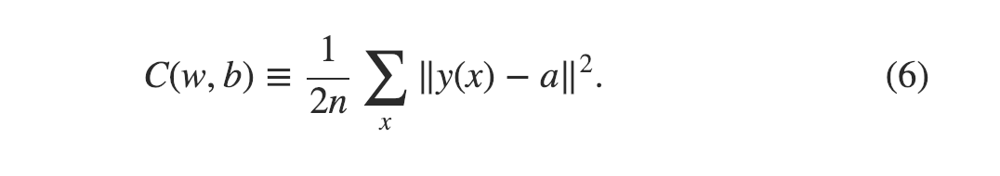

Here, w denotes the collection of all weights in the network, b all the biases, n is the total number of training inputs, a is the vector of outputs from the network when x is input, and the sum is over all training inputs, x. Of course, the output a depends on x, w and b, but to keep the notation simple I haven't explicitly indicated this dependence. The notation ‖v‖ just denotes the usual length function for a vector v. We'll call C the quadratic cost function; it's also sometimes known as the mean squared error or just MSE. Inspecting the form of the quadratic cost function, we see that C(w,b) is non-negative, since every term in the sum is non-negative. Furthermore, the cost C(w,b) becomes small, i.e., C(w,b)≈0, precisely when y(x) is approximately equal to the output, a, for all training inputs, x. So our training algorithm has done a good job if it can find weights and biases so that C(w,b)≈0. By contrast, it's not doing so well when C(w,b) is large - that would mean that y(x) is not close to the output a for a large number of inputs. So the aim of our training algorithm will be to minimize the cost C(w,b) as a function of the weights and biases. In other words, we want to find a set of weights and biases which make the cost as small as possible. We'll do that using an algorithm known as gradient descent.

在这里，w表示网络中所有权重的集合，b 所有的偏见，n是培训投入的总数，a是x时网络输出的向量输入，总和超过所有训练输入，x。当然，输出一个取决于 x，w和b，但为了使符号简单，我没有明确表示这种依赖性。符号“ v ”仅表示向量v的通常长度函数。我们打电话给C.的 二次代价函数; 它有时也被称为均方误差或只是MSE。检查二次成本函数的形式，我们看到 C（w ，b ）是非负的，因为总和中的每个项都是非负的。此外，成本C.（w ，b ）变小，即C（瓦特，b ）≈ 0，恰恰是当y （x）大约等于输出，a，对于所有培训输入，x。因此，我们的训练算法做了很好的工作，如果能找到重量和偏见，使Ç（瓦特，b ）≈ 0。相比之下，当C时，它的表现并不好（w ，b ）很大 - 这意味着y （x）不接近输出a对于大量的输入。因此，我们的训练算法的目标是最小化成本C.（w ，b ）作为权重和偏见的函数。换句话说，我们希望找到一组权重和偏差，使成本尽可能小。我们将使用称为梯度下降的算法来做到这一点。

Why introduce the quadratic cost? After all, aren't we primarily interested in the number of images correctly classified by the network? Why not try to maximize that number directly, rather than minimizing a proxy measure like the quadratic cost? The problem with that is that the number of images correctly classified is not a smooth function of the weights and biases in the network. For the most part, making small changes to the weights and biases won't cause any change at all in the number of training images classified correctly. That makes it difficult to figure out how to change the weights and biases to get improved performance. If we instead use a smooth cost function like the quadratic cost it turns out to be easy to figure out how to make small changes in the weights and biases so as to get an improvement in the cost. That's why we focus first on minimizing the quadratic cost, and only after that will we examine the classification accuracy.

为什么要引入二次成本？毕竟，我们不是主要对网络正确分类的图像数量感兴趣吗？为什么不尝试直接最大化这个数字，而不是像二次成本那样最小化代理度量呢？问题在于正确分类的图像数量不是网络中权重和偏差的平滑函数。在大多数情况下，对权重和偏差进行小的改变不会导致正确分类的训练图像的数量发生任何变化。这使得很难弄清楚如何改变权重和偏差以获得改进的性能。如果我们改为使用像二次成本那样的平滑成本函数，那么很容易弄清楚如何对权重和偏差进行微小的改变，从而提高成本。

Even given that we want to use a smooth cost function, you may still wonder why we choose the quadratic function used in Equation (6). Isn't this a rather ad hoc choice? Perhaps if we chose a different cost function we'd get a totally different set of minimizing weights and biases? This is a valid concern, and later we'll revisit the cost function, and make some modifications. However, the quadratic cost function of Equation (6) works perfectly well for understanding the basics of learning in neural networks, so we'll stick with it for now.

即使我们想要使用平滑的成本函数，您仍然可能想知道为什么我们选择等式（6）中使用的二次函数。这不是一个特别的选择吗？也许如果我们选择不同的成本函数，我们会得到一组完全不同的权重和偏差？这是一个有效的问题，稍后我们将重新审视成本函数，并进行一些修改。然而，方程（6）的二次成本函数非常适合理解神经网络中的学习基础，因此我们现在将坚持使用它。

Recapping, our goal in training a neural network is to find weights and biases which minimize the quadratic cost function C(w,b). This is a well-posed problem, but it's got a lot of distracting structure as currently posed - the interpretation of w and b as weights and biases, the σ function lurking in the background, the choice of network architecture, MNIST, and so on. It turns out that we can understand a tremendous amount by ignoring most of that structure, and just concentrating on the minimization aspect. So for now we're going to forget all about the specific form of the cost function, the connection to neural networks, and so on. Instead, we're going to imagine that we've simply been given a function of many variables and we want to minimize that function. We're going to develop a technique called gradient descent which can be used to solve such minimization problems. Then we'll come back to the specific function we want to minimize for neural networks.

重新定位，我们训练神经网络的目标是找到最小化二次成本函数C的权重和偏差（w ，b ）。这是一个很好的问题，但它有很多令人分心的结构，正如目前所提出的那样 - 对w的解释和b作为权重和偏见，σ功能潜伏在后台，网络架构的选择，MNIST等。事实证明，我们可以通过忽略大部分结构来理解大量数据，而只关注最小化方面。所以现在我们将忘记所有关于成本函数的特定形式，与神经网络的连接等等。相反，我们会想象我们只是被赋予了许多变量的函数，我们希望最小化该函数。我们将开发一种称为梯度下降的技术，可用于解决这种最小化问题。然后我们将回到我们想要最小化神经网络的特定函数。

Okay, let's suppose we're trying to minimize some function, C(v). This could be any real-valued function of many variables, v=v1,v2,…. Note that I've replaced the w and b notation by v to emphasize that this could be any function - we're not specifically thinking in the neural networks context any more. To minimize C(v) it helps to imagine C as a function of just two variables, which we'll call v1 and v2:

好吧，我们假设我们正试图最小化某些功能，C（v ）。这可以是许多变量的任何实值函数，v = v1，v2，...。请注意，我已经取代了w和bv的符号 强调这可能是任何功能 - 我们不再专注于神经网络环境。尽量减少C.（v ）它有助于想象C作为两个变量的函数，我们称之为v1和v2：


What we'd like is to find where C achieves its global minimum. Now, of course, for the function plotted above, we can eyeball the graph and find the minimum. In that sense, I've perhaps shown slightly too simple a function! A general function, C, may be a complicated function of many variables, and it won't usually be possible to just eyeball the graph to find the minimum.

我们想要的是找到C的位置达到全球最低标准。当然，现在，对于上面绘制的函数，我们可以看到图表并找到最小值。在这个意义上，我也许略显 过于简单的功能！一般功能，C，可能是许多变量的复杂函数，并且通常不可能仅仅通过眼球来找到最小值。

One way of attacking the problem is to use calculus to try to find the minimum analytically. We could compute derivatives and then try using them to find places where C is an extremum. With some luck that might work when C is a function of just one or a few variables. But it'll turn into a nightmare when we have many more variables. And for neural networks we'll often want far more variables - the biggest neural networks have cost functions which depend on billions of weights and biases in an extremely complicated way. Using calculus to minimize that just won't work!

解决问题的一种方法是使用微积分来试图找到最小的分析。我们可以计算衍生物，然后尝试使用它们来找到C的位置是一个极端。有一些运气可能在C时起作用只是一个或几个变量的函数。但是当我们有更多变量时，它将变成一场噩梦。而对于神经网络，我们会经常要远远更多的变数-最大的神经网络有依赖于数十亿重量和偏见的一个极其复杂的方式成本函数。使用微积分来最小化那个就行不通！

(After asserting that we'll gain insight by imagining C as a function of just two variables, I've turned around twice in two paragraphs and said, "hey, but what if it's a function of many more than two variables?" Sorry about that. Please believe me when I say that it really does help to imagine C as a function of two variables. It just happens that sometimes that picture breaks down, and the last two paragraphs were dealing with such breakdowns. Good thinking about mathematics often involves juggling multiple intuitive pictures, learning when it's appropriate to use each picture, and when it's not.)

（断言我们通过想象C来获得洞察力作为两个变量的函数，我在两个段落中转了两次并说，“嘿，但如果它是两个以上变量的函数呢？” 对于那个很抱歉。当我说它确实有助于想象C时，请相信我作为两个变量的函数。只是有时候这张照片会破裂，最后两段正在处理这些故障。对数学的好思考通常涉及处理多个直观的图片，学习何时适合使用每张图片，何时不适用。）

Okay, so calculus doesn't work. Fortunately, there is a beautiful analogy which suggests an algorithm which works pretty well. We start by thinking of our function as a kind of a valley. If you squint just a little at the plot above, that shouldn't be too hard. And we imagine a ball rolling down the slope of the valley. Our everyday experience tells us that the ball will eventually roll to the bottom of the valley. Perhaps we can use this idea as a way to find a minimum for the function? We'd randomly choose a starting point for an (imaginary) ball, and then simulate the motion of the ball as it rolled down to the bottom of the valley. We could do this simulation simply by computing derivatives (and perhaps some second derivatives) of C - those derivatives would tell us everything we need to know about the local "shape" of the valley, and therefore how our ball should roll.

好的，所以微积分不起作用。幸运的是，有一个漂亮的类比，它提出了一种运行良好的算法。我们首先将我们的功能视为一种山谷。如果你在上面的情节稍微眯一下，那应该不会太难。我们想象一个球从山谷的斜坡上滚下来。我们的日常经验告诉我们，球最终会滚到山谷的底部。也许我们可以用这个想法来找到函数的最小值？我们随机选择一个（假想的）球的起点，然后模拟球向下滚动到山谷底部时的运动。我们可以简单地通过计算的衍生物（也许还有一些二阶导数），这样做模拟Ç - 那些衍生物会告诉我们关于山谷局部“形状”的所有信息，以及我们的球应该如何滚动。

Based on what I've just written, you might suppose that we'll be trying to write down Newton's equations of motion for the ball, considering the effects of friction and gravity, and so on. Actually, we're not going to take the ball-rolling analogy quite that seriously - we're devising an algorithm to minimize C, not developing an accurate simulation of the laws of physics! The ball's-eye view is meant to stimulate our imagination, not constrain our thinking. So rather than get into all the messy details of physics, let's simply ask ourselves: if we were declared God for a day, and could make up our own laws of physics, dictating to the ball how it should roll, what law or laws of motion could we pick that would make it so the ball always rolled to the bottom of the valley?

根据我刚刚写的内容，你可能会认为我们会考虑摩擦力和重力的影响等来写下牛顿的球运动方程。实际上，我们不会非常认真地对待滚球比赛 - 我们正在设计一种算法来最小化C，没有开发出物理定律的精确模拟！球的视角旨在激发我们的想象力，而不是限制我们的思维。因此，不要深入了解物理学的所有细节，让我们简单地问自己：如果我们被宣布为上帝一天，并且可以制定我们自己的物理定律，指挥它应该如何滚动，什么法律或法律我们可以选择运动，这样球会一直滚到山谷的底部吗？

To make this question more precise, let's think about what happens when we move the ball a small amount Δv1 in the v1 direction, and a small amount Δv2 in the v2 direction. Calculus tells us that C changes as follows:

为了使这个问题更准确，让我们想想会发生什么，当我们移动球少量Δ v1在诉讼中1 方向，和少量Δ v2在诉讼中2方向。微积分告诉我们C 变化如下：

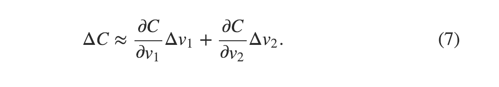

We're going to find a way of choosing Δv1 and Δv2 so as to make ΔC negative; i.e., we'll choose them so the ball is rolling down into the valley. To figure out how to make such a choice it helps to define Δv to be the vector of changes in v, Δv≡(Δv1,Δv2)T, where T is again the transpose operation, turning row vectors into column vectors. We'll also define the gradient of C to be the vector of partial derivatives, (∂C∂v1,∂C∂v2)T. We denote the gradient vector by ∇C, i.e.:

我们会发现选择的一种方式Δ v1和Δ v2以使Δ Ç负; 也就是说，我们会选择它们，这样球就会滚落到山谷中。为了弄清楚如何作出这样的选择，它有助于确定Δ v成为v中变化的载体， Δ v ≡ （Δ v1，Δ v2）Ť，其中T.再次是转置操作，将行向量转换为列向量。我们也将定义渐变的Ç 是偏导数的向量，（∂ Ç∂ v1，∂ Ç∂ v2）Ť。我们用梯度向量∇ Ç，即：

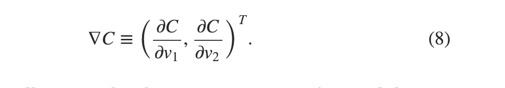

In a moment we'll rewrite the change ΔC in terms of Δv and the gradient, ∇C. Before getting to that, though, I want to clarify something that sometimes gets people hung up on the gradient. When meeting the ∇C notation for the first time, people sometimes wonder how they should think about the ∇ symbol. What, exactly, does ∇ mean? In fact, it's perfectly fine to think of ∇C as a single mathematical object - the vector defined above - which happens to be written using two symbols. In this point of view, ∇ is just a piece of notational flag-waving, telling you "hey, ∇C is a gradient vector". There are more advanced points of view where ∇ can be viewed as an independent mathematical entity in its own right (for example, as a differential operator), but we won't need such points of view.

在一个时刻，我们将改写变化Δ Ç来讲Δ v 和梯度，∇ Ç。然而，在谈到这一点之前，我想澄清一些有时会让人们挂起渐变的东西。当满足∇ Ç人们有时会想到他们应该如何思考∇ 符号。究竟是什么∇意思？事实上，这是完全没有想到的∇ Ç作为单个数学对象 - 上面定义的向量 - 恰好使用两个符号编写。从这个角度来看，∇只是一块符号上挥舞旗帜，告诉你：“嘿，的∇ Ç是一个渐变向量“。有更高级的观点，其中∇ 可以被视为一个独立的数学实体（例如，作为微分算子），但我们不需要这样的观点。

With these definitions, the expression (7) for ΔC can be rewritten as

利用这些定义，表达式（7）为 Δ Ç 可以改写为


This equation helps explain why ∇C is called the gradient vector: ∇C relates changes in v to changes in C, just as we'd expect something called a gradient to do. But what's really exciting about the equation is that it lets us see how to choose Δv so as to make ΔC negative. In particular, suppose we choose

这个公式有助于解释为什么∇ Ç被称为梯度矢量：∇ Ç关联v的变化改变C就像我们期望一种叫做渐变的东西一样。但是，什么是真正令人兴奋的公式是，它让我们看到了如何选择 Δ v以使Δ Ç负。特别是，假设我们选择


where η is a small, positive parameter (known as the learning rate). Then Equation (9) tells us that ΔC≈−η∇C⋅∇C=−η‖∇C‖2. Because ‖∇C‖2≥0, this guarantees that ΔC≤0, i.e., C will always decrease, never increase, if we change v according to the prescription in (10). (Within, of course, the limits of the approximation in Equation (9)). This is exactly the property we wanted! And so we'll take Equation (10) to define the "law of motion" for the ball in our gradient descent algorithm. That is, we'll use Equation (10) to compute a value for Δv, then move the ball's position v by that amount:

其中η是一个小的，积极的参数（称为 学习率）。然后式（9）告诉我们，Δ Ç≈ - η ＆dtri; C ^＆CenterDot;＆∇ Ç= - η ‖ ∇ Ç‖2。由于‖ ∇ Ç‖2≥ 0这保证了Δ Ç≤ 0，即C.如果我们改变v，它将永远减少，永不增加根据（10）中的处方。（当然，在等式（9）中的近似值的范围内）。这正是我们想要的财产！因此，我们将采用公式（10）来定义我们的梯度下降算法中的球的“运动定律”。也就是说，我们将使用等式（10）来计算的值Δ v，然后移动球的位置v 按此数额：


Then we'll use this update rule again, to make another move. If we keep doing this, over and over, we'll keep decreasing C until - we hope - we reach a global minimum.

然后我们将再次使用此更新规则，以进行另一项操作。如果我们继续这样做，一遍又一遍，我们将继续减少C. 直到 - 我们希望 - 我们达到全球最低标准。

Summing up, the way the gradient descent algorithm works is to repeatedly compute the gradient ∇C, and then to move in the opposite direction, "falling down" the slope of the valley. We can visualize it like this:

综上，梯度下降算法的工作方式是重复计算的梯度∇ Ç，然后向 相反方向移动，“落下”山谷的斜坡。我们可以像这样想象它：


Notice that with this rule gradient descent doesn't reproduce real physical motion. In real life a ball has momentum, and that momentum may allow it to roll across the slope, or even (momentarily) roll uphill. It's only after the effects of friction set in that the ball is guaranteed to roll down into the valley. By contrast, our rule for choosing Δv just says "go down, right now". That's still a pretty good rule for finding the minimum!

请注意，使用此规则，梯度下降不会再现真实的物理运动。在现实生活中，球具有动量，并且该动量可以允许它在斜坡上滚动，或者甚至（暂时）滚动上坡。只有在摩擦力影响之后，球才能保证滚入山谷。相比之下，我们的规则选择Δ v只是说“现在下去”。找到最低限度仍然是一个很好的规则！

To make gradient descent work correctly, we need to choose the learning rate η to be small enough that Equation (9) is a good approximation. If we don't, we might end up with ΔC>0, which obviously would not be good! At the same time, we don't want η to be too small, since that will make the changes Δv tiny, and thus the gradient descent algorithm will work very slowly. In practical implementations, η is often varied so that Equation (9) remains a good approximation, but the algorithm isn't too slow. We'll see later how this works.

为了使梯度下降正常工作，我们需要选择学习率η足够小，等式（9）是一个很好的近似值。如果我们不这样做，我们可能最终Δ Ç> 0，这显然不会很好！与此同时，我们不希望η太小，因为这将使变化Δ v微小的，因此梯度下降算法将非常缓慢地工作。在实际实现中，η通常是变化的，因此等式（9）仍然是一个很好的近似，但算法不是太慢。我们稍后会看到它是如何工作的。

I've explained gradient descent when C is a function of just two variables. But, in fact, everything works just as well even when C is a function of many more variables. Suppose in particular that C is a function of m variables, v1,…,vm. Then the change ΔC in C produced by a small change Δv=(Δv1,…,Δvm)T is

我在C时解释了梯度下降只是两个变量的函数。但事实上，即使在C时，一切都能正常工作 是更多变量的函数。特别假设C 是m的函数变量，v1，... ，v米。则改变 Δ Ç在C.通过一个小的变化而产生Δ v = （Δ v1，... ，Δ v米）Ť 是


where the gradient ∇C is the vector

其中梯度∇ Ç 是矢量

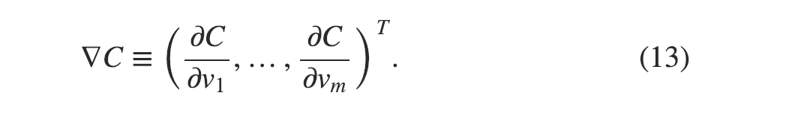

Just as for the two variable case, we can choose

正如两个变量的情况一样，我们可以选择


and we're guaranteed that our (approximate) expression (12) for ΔC will be negative. This gives us a way of following the gradient to a minimum, even when C is a function of many variables, by repeatedly applying the update rule

并且我们保证我们的（近似）的表达（12）为Δ Ç将是负面的。这为我们提供了一种将梯度跟踪到最小的方法，即使在 C时也是如此 通过重复应用更新规则，它是许多变量的函数


You can think of this update rule as defining the gradient descent algorithm. It gives us a way of repeatedly changing the position v in order to find a minimum of the function C. The rule doesn't always work - several things can go wrong and prevent gradient descent from finding the global minimum of C, a point we'll return to explore in later chapters. But, in practice gradient descent often works extremely well, and in neural networks we'll find that it's a powerful way of minimizing the cost function, and so helping the net learn.

您可以将此更新规则视为定义梯度下降算法。它给我们的一再改变位置的方式v为了找到函数C的最小值。规则并不总是有效 - 有些事情可能会出错，并防止梯度下降找到C的全局最小值，我们将在后面的章节中回顾探讨这一点。但是，在实践中，梯度下降通常效果非常好，而在神经网络中，我们会发现它是一种最小化成本函数的有效方法，因此有助于网络学习。

Indeed, there's even a sense in which gradient descent is the optimal strategy for searching for a minimum. Let's suppose that we're trying to make a move Δv in position so as to decrease C as much as possible. This is equivalent to minimizing ΔC≈∇C⋅Δv. We'll constrain the size of the move so that ‖Δv‖=ϵ for some small fixed ϵ>0. In other words, we want a move that is a small step of a fixed size, and we're trying to find the movement direction which decreases C as much as possible. It can be proved that the choice of Δv which minimizes ∇C⋅Δv is Δv=−η∇C, where η=ϵ/‖∇C‖ is determined by the size constraint ‖Δv‖=ϵ. So gradient descent can be viewed as a way of taking small steps in the direction which does the most to immediately decrease C.

实际上，甚至有一种感觉，即梯度下降是寻找最小值的最佳策略。让我们假设我们正在努力使一招Δ v在适当的位置，以减少C.越多越好。这相当于最小化Δ Ç≈ ∇ Ç＆CenterDot;＆Δ v。我们将约束移动，这样的尺寸‖ Δ v ‖ = ε对于一些小的固定ε > 0。换句话说，我们想要一个固定大小的小步骤，我们试图找到减少C的运动方向越多越好。它可以证明的选择Δ v其最小化∇ Ç＆CenterDot;＆Δ v是Δ v = - η ＆dtri; C ^，其中η = ε / ‖ ∇ Ç‖是由大小约束来确定‖ Δ v ‖ = ε。因此，梯度下降可以被视为在最大程度上减少C的方向上采取小步骤的方式。

People have investigated many variations of gradient descent, including variations that more closely mimic a real physical ball. These ball-mimicking variations have some advantages, but also have a major disadvantage: it turns out to be necessary to compute second partial derivatives of C, and this can be quite costly. To see why it's costly, suppose we want to compute all the second partial derivatives ∂2C/∂vj∂vk. If there are a million such vj variables then we'd need to compute something like a trillion (i.e., a million squared) second partial derivatives!That's going to be computationally costly. With that said, there are tricks for avoiding this kind of problem, and finding alternatives to gradient descent is an active area of investigation. But in this book we'll use gradient descent (and variations) as our main approach to learning in neural networks.

人们已经研究了梯度下降的许多变化，包括更接近模仿真实物理球的变化。这些仿球变化有一些优点，但也有一个主要的缺点：事实证明有必要计算C的第二偏导数。，这可能是非常昂贵的。为了了解为什么它成本很高，假设我们想要计算所有第二个偏导数∂2C/ ∂ vĴ∂ vķ。如果有一百万这样的vĴ变量然后我们需要计算像万亿（即一百万平方）的第二偏导数!这将是计算成本高昂的。话虽如此，有一些技巧可以避免这种问题，找到梯度下降的替代方案是一个活跃的调查领域。但在本书中，我们将使用梯度下降（和变化）作为我们在神经网络中学习的主要方法。

How can we apply gradient descent to learn in a neural network? The idea is to use gradient descent to find the weights wk and biases bl which minimize the cost in Equation (6). To see how this works, let's restate the gradient descent update rule, with the weights and biases replacing the variables vj. In other words, our "position" now has components wk and bl, and the gradient vector ∇C has corresponding components ∂C/∂wk and ∂C/∂bl. Writing out the gradient descent update rule in terms of components, we have

我们如何应用梯度下降来学习神经网络？想法是使用梯度下降来找到权重wķ和偏见 b升这使方程（6）中的成本最小化。为了了解这是如何工作的，让我们重新说明梯度下降更新规则，权重和偏差代替变量vĴ。换句话说，我们的“位置”现在有组件wķ和b升和梯度向量∇ Ç具有相应的组件∂ Ç/ ∂ w ^ķ和∂ Ç/ ∂ b升。根据组件写出梯度下降更新规则，我们有

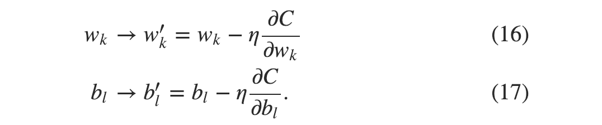

By repeatedly applying this update rule we can "roll down the hill", and hopefully find a minimum of the cost function. In other words, this is a rule which can be used to learn in a neural network.

通过重复应用此更新规则，我们可以“滚下山坡”，并希望找到最低成本函数。换句话说，这是一个可用于在神经网络中学习的规则。

There are a number of challenges in applying the gradient descent rule. We'll look into those in depth in later chapters. But for now I just want to mention one problem. To understand what the problem is, let's look back at the quadratic cost in Equation (6). Notice that this cost function has the form C=1n∑xCx, that is, it's an average over costs Cx≡‖y(x)−a‖22 for individual training examples. In practice, to compute the gradient ∇C we need to compute the gradients ∇Cx separately for each training input, x, and then average them, ∇C=1n∑x∇Cx. Unfortunately, when the number of training inputs is very large this can take a long time, and learning thus occurs slowly.

应用梯度下降规则存在许多挑战。我们将在后面的章节中深入研究这些内容。但是现在我只想提一个问题。为了解问题是什么，让我们回顾等式（6）中的二次成本。请注意，此成本函数的格式为C.= 1ñΣXCX，也就是说，它是成本C的平均值X≡ ‖ ÿ （X）- 一个‖22用于个人训练的例子。在实践中，以计算梯度∇ Ç我们需要计算梯度∇ ÇX分别为每个训练输入，x，然后取它们的平均值，∇ Ç= 1ñΣX∇ çX。不幸的是，当训练输入的数量非常大时，这可能花费很长时间，因此学习缓慢发生。

An idea called stochastic gradient descent can be used to speed up learning. The idea is to estimate the gradient ∇C by computing ∇Cx for a small sample of randomly chosen training inputs. By averaging over this small sample it turns out that we can quickly get a good estimate of the true gradient ∇C, and this helps speed up gradient descent, and thus learning.

称为随机梯度下降的想法可用于加速学习。我们的想法是，以估计梯度∇ Ç通过计算∇ ÇX对于随机选择的训练输入的小样本。通过平均这个小样本事实证明，我们可以迅速得到真正梯度的一个很好的估计∇ Ç，这有助于加快梯度下降，从而学习。

To make these ideas more precise, stochastic gradient descent works by randomly picking out a small number m of randomly chosen training inputs. We'll label those random training inputs X1,X2,…,Xm, and refer to them as a mini-batch. Provided the sample size m is large enough we expect that the average value of the ∇CXj will be roughly equal to the average over all ∇Cx, that is,

为了使这些想法更加精确，随机梯度下降通过随机挑出一小部分m来工作随机选择的训练输入。我们将标记那些随机训练输入X.1，X2，... ，X米，并将它们称为小批量。提供样本大小m足够大，我们预计的平均值 ∇ ÇXĴ将大致等于平均在所有∇ ÇX， 那是，

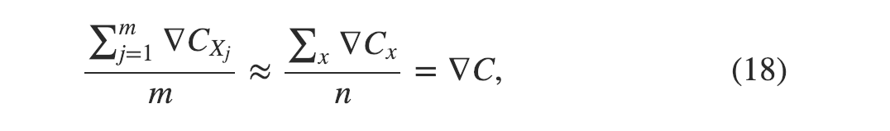

where the second sum is over the entire set of training data. Swapping sides we get

其中第二个总和超过整套训练数据。我们交换的方面

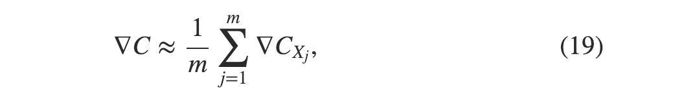

confirming that we can estimate the overall gradient by computing gradients just for the randomly chosen mini-batch.

确认我们可以通过计算随机选择的小批量的梯度来估计总梯度。


To connect this explicitly to learning in neural networks, suppose wk and bl denote the weights and biases in our neural network. Then stochastic gradient descent works by picking out a randomly chosen mini-batch of training inputs, and training with those,

为了将它明确地连接到神经网络中的学习，假设 wķ和b升表示我们的神经网络中的权重和偏差。然后随机梯度下降通过挑选随机选择的一小批训练输入，并进行训练，

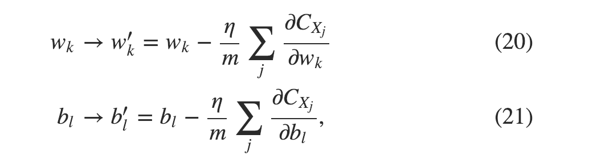

where the sums are over all the training examples Xj in the current mini-batch. Then we pick out another randomly chosen mini-batch and train with those. And so on, until we've exhausted the training inputs, which is said to complete an epoch of training. At that point we start over with a new training epoch.

其中总和超过了所有训练样例X.Ĵ在目前的小批量。然后我们选择另一个随机选择的小批量和训练。等等，直到我们用完培训投入，据说完成了一个 训练时代。那时我们重新开始一个新的训练时代。

Incidentally, it's worth noting that conventions vary about scaling of the cost function and of mini-batch updates to the weights and biases. In Equation (6) we scaled the overall cost function by a factor 1n. People sometimes omit the 1n, summing over the costs of individual training examples instead of averaging. This is particularly useful when the total number of training examples isn't known in advance. This can occur if more training data is being generated in real time, for instance. And, in a similar way, the mini-batch update rules (20) and (21) sometimes omit the 1m term out the front of the sums. Conceptually this makes little difference, since it's equivalent to rescaling the learning rate η. But when doing detailed comparisons of different work it's worth watching out for.

顺便提一下，值得注意的是，约定不同于成本函数的缩放以及权重和偏差的小批量更新。在等式（6）中，我们将总成本函数缩放了1倍ñ。人们有时会省略 1ñ，总结个别训练样本的成本而不是平均。当事先不知道训练样例的总数时，这尤其有用。例如，如果实时生成更多训练数据，则会发生这种情况。并且，以类似的方式，小批量更新规则（20） 和（21）有时省略1米说出总和的前面。从概念上讲，这几乎没有什么区别，因为它相当于重新调整学习率η。但是，在对不同工作进行详细比较时，值得关注。

We can think of stochastic gradient descent as being like political polling: it's much easier to sample a small mini-batch than it is to apply gradient descent to the full batch, just as carrying out a poll is easier than running a full election. For example, if we have a training set of size n=60,000, as in MNIST, and choose a mini-batch size of (say) m=10, this means we'll get a factor of 6,000 speedup in estimating the gradient! Of course, the estimate won't be perfect - there will be statistical fluctuations - but it doesn't need to be perfect: all we really care about is moving in a general direction that will help decrease C, and that means we don't need an exact computation of the gradient. In practice, stochastic gradient descent is a commonly used and powerful technique for learning in neural networks, and it's the basis for most of the learning techniques we'll develop in this book.

我们可以认为随机梯度下降就像政治民意调查一样：对一小批小批量采样要比将梯度下降应用于整批更容易，就像进行民意调查比进行全面选举更容易一样。例如，如果我们有规模的训练集ñ = 60 ，000，如在MNIST中，并选择小批量（例如）m = 10，这意味着我们将得到的因素 6 ，000加快估算梯度！当然，估计不会是完美的 - 会有统计波动 - 但它并不需要是完美的：我们真正关心的是朝着有助于减少C的大方向前进，这意味着我们不需要精确计算梯度。在实践中，随机梯度下降是在神经网络中学习的常用且强大的技术，并且它是我们将在本书中开发的大多数学习技术的基础。

Let me conclude this section by discussing a point that sometimes bugs people new to gradient descent. In neural networks the cost C is, of course, a function of many variables - all the weights and biases - and so in some sense defines a surface in a very high-dimensional space. Some people get hung up thinking: "Hey, I have to be able to visualize all these extra dimensions". And they may start to worry: "I can't think in four dimensions, let alone five (or five million)". Is there some special ability they're missing, some ability that "real" supermathematicians have? Of course, the answer is no. Even most professional mathematicians can't visualize four dimensions especially well, if at all. The trick they use, instead, is to develop other ways of representing what's going on. That's exactly what we did above: we used an algebraic (rather than visual) representation of ΔC to figure out how to move so as to decrease C. People who are good at thinking in high dimensions have a mental library containing many different techniques along these lines; our algebraic trick is just one example. Those techniques may not have the simplicity we're accustomed to when visualizing three dimensions, but once you build up a library of such techniques, you can get pretty good at thinking in high dimensions. I won't go into more detail here, but if you're interested then you may enjoy reading this discussion of some of the techniques professional mathematicians use to think in high dimensions. While some of the techniques discussed are quite complex, much of the best content is intuitive and accessible, and could be mastered by anyone.

让我在结束本节时讨论一个有时会让人们对梯度下降感到不满的问题。在神经网络中，成本为C.当然，它是许多变量的函数 - 所有的权重和偏差 - 因此在某种意义上定义了一个非常高维空间的表面。有些人开始思考：“嘿，我必须能够想象出所有这些额外的尺寸”。而且他们可能会开始担心：“我不能在四个方面思考，更不用说五个（或五百万）”。他们缺少一些特殊的能力，“真正的”超级数学家有哪些能力？当然，答案是否定的。即使是大多数专业数学家也无法将四个维度可视化，如果有的话。相反，他们使用的技巧是开发其他方式来表示正在发生的事情。这正是我们上面那样：我们使用了代数（而不是视觉）的表示Δ Ç弄清楚如何移动以减少C.。擅长高维度思考的人有一个包含许多不同技术的心理图书馆; 我们的代数技巧只是一个例子。这些技术可能没有我们在三维可视化时所习惯的简单性，但是一旦你建立了这样的技术库，你就可以很好地思考高维度。我不会在这里详细介绍，但如果您感兴趣，那么您可能会喜欢阅读 有关专业数学家用于高维度思考的一些技术的讨论。虽然所讨论的一些技术非常复杂，但大多数最好的内容都是直观且易于访问的，并且可以被任何人掌握。

## Implementing our network to classify digits 实现我们的网络以对数字进行分类
Alright, let's write a program that learns how to recognize handwritten digits, using stochastic gradient descent and the MNIST training data. We'll do this with a short Python (2.7) program, just 74 lines of code! The first thing we need is to get the MNIST data. If you're a git user then you can obtain the data by cloning the code repository for this book,

好吧，让我们编写一个程序，学习如何识别手写数字，使用随机梯度下降和MNIST训练数据。我们将使用一个简短的Python（2.7）程序，只需74行代码！我们需要的第一件事是获取MNIST数据。如果你是一个git用户，那么你可以通过克隆本书的代码库来获取数据，

    git clone https://github.com/mnielsen/neural-networks-and-deep-learning.git

If you don't use git then you can download the data and code here.

如果你不使用git，那么你可以在这里下载数据和代码 。

Incidentally, when I described the MNIST data earlier, I said it was split into 60,000 training images, and 10,000 test images. That's the official MNIST description. Actually, we're going to split the data a little differently. We'll leave the test images as is, but split the 60,000-image MNIST training set into two parts: a set of 50,000 images, which we'll use to train our neural network, and a separate 10,000 image validation set. We won't use the validation data in this chapter, but later in the book we'll find it useful in figuring out how to set certain hyper-parameters of the neural network - things like the learning rate, and so on, which aren't directly selected by our learning algorithm. Although the validation data isn't part of the original MNIST specification, many people use MNIST in this fashion, and the use of validation data is common in neural networks. When I refer to the "MNIST training data" from now on, I'll be referring to our 50,000 image data set, not the original 60,000 image data set.

顺便提一下，当我之前描述MNIST数据时，我说它被分成了60,000个训练图像和10,000个测试图像。这是官方的MNIST描述。实际上，我们将以稍微不同的方式分割数据。我们将保留测试图像，但将60,000图像MNIST训练集分成两部分：一组50,000个图像，我们将用它来训练我们的神经网络，以及一个单独的10,000个图像验证集。我们不会在本章中使用验证数据，但在本书后面我们会发现它有助于确定如何设置某些 超参数神经网络 - 例如学习速率等等，它们不是由我们的学习算法直接选择的。尽管验证数据不是原始MNIST规范的一部分，但许多人以这种方式使用MNIST，并且验证数据的使用在神经网络中很常见。当我从现在开始参考“MNIST训练数据”时，我将指的是我们的50,000个图像数据集，而不是原始的60,000个图像数据集.

Apart from the MNIST data we also need a Python library called Numpy, for doing fast linear algebra. If you don't already have Numpy installed, you can get it here.

除了MNIST数据之外，我们还需要一个名为Numpy的Python库 来进行快速线性代数。如果您还没有安装Numpy，可以在此处获取 。

Let me explain the core features of the neural networks code, before giving a full listing, below. The centerpiece is a Network class, which we use to represent a neural network. Here's the code we use to initialize a Network object:

在下面给出完整列表之前，让我解释一下神经网络代码的核心功能。核心是一个网络 类，我们用它来代表一个神经网络。这是我们用来初始化Network对象的代码：

```
class Network(object):

    def __init__(self, sizes):
        self.num_layers = len(sizes)
        self.sizes = sizes
        self.biases = [np.random.randn(y, 1) for y in sizes[1:]]
        self.weights = [np.random.randn(y, x) 
                        for x, y in zip(sizes[:-1], sizes[1:])]
```

In this code, the list sizes contains the number of neurons in the respective layers. So, for example, if we want to create a Network object with 2 neurons in the first layer, 3 neurons in the second layer, and 1 neuron in the final layer, we'd do this with the code:

在此代码中，列表大小包含各个层中的神经元数量。因此，例如，如果我们想创建一个 Network对象，第一层有2个神经元，第二层有3个神经元，最后一层有1个神经元，我们用代码来做：

```
net = Network([2, 3, 1])
```

The biases and weights in the Network object are all initialized randomly, using the Numpy np.random.randn function to generate Gaussian distributions with mean 0 and standard deviation 1. This random initialization gives our stochastic gradient descent algorithm a place to start from. In later chapters we'll find better ways of initializing the weights and biases, but this will do for now. Note that the Network initialization code assumes that the first layer of neurons is an input layer, and omits to set any biases for those neurons, since biases are only ever used in computing the outputs from later layers.

网络对象中的偏差和权重都是随机初始化的，使用Numpy np.random.randn函数生成均值为0的高斯分布和标准差1。这种随机初始化为我们的随机梯度下降算法提供了一个起点。在后面的章节中，我们将找到更好的方法来初始化权重和偏差，但现在这样做。请注意，网络初始化代码假定第一层神经元是输入层，并且省略为这些神经元设置任何偏差，因为偏差仅用于计算后面层的输出。

Note also that the biases and weights are stored as lists of Numpy matrices. So, for example net.weights[1] is a Numpy matrix storing the weights connecting the second and third layers of neurons. (It's not the first and second layers, since Python's list indexing starts at 0.) Since net.weights[1] is rather verbose, let's just denote that matrix w. It's a matrix such that wjk is the weight for the connection between the kth neuron in the second layer, and the jth neuron in the third layer. This ordering of the j and k indices may seem strange - surely it'd make more sense to swap the j and k indices around? The big advantage of using this ordering is that it means that the vector of activations of the third layer of neurons is:

另请注意，偏差和权重存储为Numpy矩阵列表。因此，例如net.weights [1]是一个Numpy矩阵，存储连接第二层和第三层神经元的权重。（这不是第一层和第二层，因为Python的列表索引从0开始。）由于net.weights [1]相当冗长，我们只是表示矩阵w。它是w的矩阵Ĵķ 是k之间连接的权重ŤH第二层中的神经元和jŤH神经元在第三层。这个j的排序和k指数可能看起来很奇怪 - 肯定交换j更有意义和k各地指数？使用这种排序的最大好处是它意味着第三层神经元的激活矢量是:


There's quite a bit going on in this equation, so let's unpack it piece by piece. a is the vector of activations of the second layer of neurons. To obtain a′ we multiply a by the weight matrix w, and add the vector b of biases. We then apply the function σ elementwise to every entry in the vector wa+b. (This is called vectorizing the function σ.) It's easy to verify that Equation (22) gives the same result as our earlier rule, Equation (4), for computing the output of a sigmoid neuron.

在这个等式中有相当多的进展，所以让我们一块一块地拆开它。 一个是第二层神经元激活的载体。获得一个“我们乘以一个通过权重矩阵w，并添加矢量b偏见 然后我们应用函数σ 元素方向到向量w a + b中的每个条目。（这称为 矢量化函数 σ。）很容易验证方程（22）给出与我们早先的规则（方程（4））相同的结果，用于计算S形神经元的输出。

With all this in mind, it's easy to write code computing the output from a Network instance. We begin by defining the sigmoid function:

考虑到这一切，编写计算Network实例输出的代码很容易。我们首先定义sigmoid函数：
```
def sigmoid(z):
    return 1.0/(1.0+np.exp(-z))
``` 

Note that when the input z is a vector or Numpy array, Numpy automatically applies the function sigmoid elementwise, that is, in vectorized form.

请注意，当输入z是向量或Numpy数组时，Numpy会自动应用sigmoid元素，即以矢量化形式。

We then add a feedforward method to the Network class, which, given an input a for the network, returns the corresponding output.All the method does is applies Equation (22) for each layer:

然后我们向Network类添加一个前馈方法，给定网络的输入a，返回相应的输出.所有方法都适用于每层的公式（22）：
```
def feedforward(self, a):
        """Return the output of the network if "a" is input."""
        for b, w in zip(self.biases, self.weights):
            a = sigmoid(np.dot(w, a)+b)
        return a

```

Of course, the main thing we want our Network objects to do is to learn. To that end we'll give them an SGD method which implements stochastic gradient descent. Here's the code. It's a little mysterious in a few places, but I'll break it down below, after the listing.

当然，我们希望Network对象做的主要事情是学习。为此，我们将为他们提供一种实现随机梯度下降的SGD方法。这是代码。在一些地方有点神秘，但我会在上市后将其分解。

```
def SGD(self, training_data, epochs, mini_batch_size, eta,
            test_data=None):
        """Train the neural network using mini-batch stochastic
        gradient descent.  The "training_data" is a list of tuples
        "(x, y)" representing the training inputs and the desired
        outputs.  The other non-optional parameters are
        self-explanatory.  If "test_data" is provided then the
        network will be evaluated against the test data after each
        epoch, and partial progress printed out.  This is useful for
        tracking progress, but slows things down substantially."""
        if test_data: n_test = len(test_data)
        n = len(training_data)
        for j in xrange(epochs):
            random.shuffle(training_data)
            mini_batches = [
                training_data[k:k+mini_batch_size]
                for k in xrange(0, n, mini_batch_size)]
            for mini_batch in mini_batches:
                self.update_mini_batch(mini_batch, eta)
            if test_data:
                print "Epoch {0}: {1} / {2}".format(
                    j, self.evaluate(test_data), n_test)
            else:
                print "Epoch {0} complete".format(j)
```

The training_data is a list of tuples (x, y) representing the training inputs and corresponding desired outputs. The variables epochs and mini_batch_size are what you'd expect - the number of epochs to train for, and the size of the mini-batches to use when sampling. eta is the learning rate, η. If the optional argument test_data is supplied, then the program will evaluate the network after each epoch of training, and print out partial progress. This is useful for tracking progress, but slows things down substantially.

所述training_data是元组的列表（X，Y） 代表训练输入和相应的期望的输出。变量时期和mini_batch_size是你所期望-历元数为训练，和小批量的大小，采样时使用。 eta是学习率 η。如果提供了可选参数test_data，则程序将在每个训练时期之后评估网络，并打印出部分进度。这对于跟踪进度很有用，但会大大减慢速度。

The code works as follows. In each epoch, it starts by randomly shuffling the training data, and then partitions it into mini-batches of the appropriate size. This is an easy way of sampling randomly from the training data. Then for each mini_batch we apply a single step of gradient descent. This is done by the code self.update_mini_batch(mini_batch, eta), which updates the network weights and biases according to a single iteration of gradient descent, using just the training data in mini_batch. Here's the code for the update_mini_batch method:

代码的工作原理如下。在每个时期，它通过随机改组训练数据开始，然后将其划分为适当大小的小批量。这是从训练数据中随机抽样的简便方法。然后，对于每个mini_batch，我们应用梯度下降的单个步骤。这是通过代码 self.update_mini_batch（mini_batch，eta）完成的，它仅使用mini_batch中的训练数据，根据梯度下降的单次迭代更新网络权重和偏差。这是update_mini_batch方法的代码：

```
def update_mini_batch(self, mini_batch, eta):
        """Update the network's weights and biases by applying
        gradient descent using backpropagation to a single mini batch.
        The "mini_batch" is a list of tuples "(x, y)", and "eta"
        is the learning rate."""
        nabla_b = [np.zeros(b.shape) for b in self.biases]
        nabla_w = [np.zeros(w.shape) for w in self.weights]
        for x, y in mini_batch:
            delta_nabla_b, delta_nabla_w = self.backprop(x, y)
            nabla_b = [nb+dnb for nb, dnb in zip(nabla_b, delta_nabla_b)]
            nabla_w = [nw+dnw for nw, dnw in zip(nabla_w, delta_nabla_w)]
        self.weights = [w-(eta/len(mini_batch))*nw 
                        for w, nw in zip(self.weights, nabla_w)]
        self.biases = [b-(eta/len(mini_batch))*nb 
                       for b, nb in zip(self.biases, nabla_b)]
```

Most of the work is done by the line

大部分工作都是由线路完成的

```
delta_nabla_b, delta_nabla_w = self.backprop(x, y)
```
This invokes something called the backpropagation algorithm, which is a fast way of computing the gradient of the cost function. So update_mini_batch works simply by computing these gradients for every training example in the mini_batch, and then updating self.weights and self.biases appropriately.

这会调用称为反向传播算法的东西，这是一种计算成本函数梯度的快速方法。因此，update_mini_batch只需为mini_batch中的每个训练示例计算这些渐变，然后适当地更新 self.weights和self.biases。

I'm not going to show the code for self.backprop right now. We'll study how backpropagation works in the next chapter, including the code for self.backprop. For now, just assume that it behaves as claimed, returning the appropriate gradient for the cost associated to the training example x.

我现在不打算显示self.backprop的代码。我们将在下一章研究反向传播的工作原理，包括self.backprop的代码。现在，假设它的行为与声明的一样，返回与训练示例x相关的成本的适当梯度。

Let's look at the full program, including the documentation strings, which I omitted above. Apart from self.backprop the program is self-explanatory - all the heavy lifting is done in self.SGD and self.update_mini_batch, which we've already discussed. The self.backprop method makes use of a few extra functions to help in computing the gradient, namely sigmoid_prime, which computes the derivative of the σ function, and self.cost_derivative, which I won't describe here. You can get the gist of these (and perhaps the details) just by looking at the code and documentation strings. We'll look at them in detail in the next chapter. Note that while the program appears lengthy, much of the code is documentation strings intended to make the code easy to understand. In fact, the program contains just 74 lines of non-whitespace, non-comment code. All the code may be found on GitHub here.

让我们看看完整的程序，包括我在上面省略的文档字符串。除了self.backprop之外，程序是不言自明的 - 所有繁重的工作都是在self.SGD 和self.update_mini_batch中完成的，我们已经讨论过了。该 self.backprop方法利用了一些额外的功能在计算梯度，即帮助sigmoid_prime，其计算的导数σ函数和 self.cost_derivative，我在这里不再赘述。您可以通过查看代码和文档字符串来获取这些（以及可能的详细信息）的要点。我们将在下一章详细介绍它们。请注意，虽然程序看起来很冗长，但很多代码都是文档字符串，旨在使代码易于理解。实际上，该程序只包含74行非空格，非注释代码。所有代码都可以在GitHub上 找到。

```
"""
network.py
~~~~~~~~~~

A module to implement the stochastic gradient descent learning
algorithm for a feedforward neural network.  Gradients are calculated
using backpropagation.  Note that I have focused on making the code
simple, easily readable, and easily modifiable.  It is not optimized,
and omits many desirable features.
"""

#### Libraries
# Standard library
import random

# Third-party libraries
import numpy as np

class Network(object):

    def __init__(self, sizes):
        """The list ``sizes`` contains the number of neurons in the
        respective layers of the network.  For example, if the list
        was [2, 3, 1] then it would be a three-layer network, with the
        first layer containing 2 neurons, the second layer 3 neurons,
        and the third layer 1 neuron.  The biases and weights for the
        network are initialized randomly, using a Gaussian
        distribution with mean 0, and variance 1.  Note that the first
        layer is assumed to be an input layer, and by convention we
        won't set any biases for those neurons, since biases are only
        ever used in computing the outputs from later layers."""
        self.num_layers = len(sizes)
        self.sizes = sizes
        self.biases = [np.random.randn(y, 1) for y in sizes[1:]]
        self.weights = [np.random.randn(y, x)
                        for x, y in zip(sizes[:-1], sizes[1:])]

    def feedforward(self, a):
        """Return the output of the network if ``a`` is input."""
        for b, w in zip(self.biases, self.weights):
            a = sigmoid(np.dot(w, a)+b)
        return a

    def SGD(self, training_data, epochs, mini_batch_size, eta,
            test_data=None):
        """Train the neural network using mini-batch stochastic
        gradient descent.  The ``training_data`` is a list of tuples
        ``(x, y)`` representing the training inputs and the desired
        outputs.  The other non-optional parameters are
        self-explanatory.  If ``test_data`` is provided then the
        network will be evaluated against the test data after each
        epoch, and partial progress printed out.  This is useful for
        tracking progress, but slows things down substantially."""
        if test_data: n_test = len(test_data)
        n = len(training_data)
        for j in xrange(epochs):
            random.shuffle(training_data)
            mini_batches = [
                training_data[k:k+mini_batch_size]
                for k in xrange(0, n, mini_batch_size)]
            for mini_batch in mini_batches:
                self.update_mini_batch(mini_batch, eta)
            if test_data:
                print "Epoch {0}: {1} / {2}".format(
                    j, self.evaluate(test_data), n_test)
            else:
                print "Epoch {0} complete".format(j)

    def update_mini_batch(self, mini_batch, eta):
        """Update the network's weights and biases by applying
        gradient descent using backpropagation to a single mini batch.
        The ``mini_batch`` is a list of tuples ``(x, y)``, and ``eta``
        is the learning rate."""
        nabla_b = [np.zeros(b.shape) for b in self.biases]
        nabla_w = [np.zeros(w.shape) for w in self.weights]
        for x, y in mini_batch:
            delta_nabla_b, delta_nabla_w = self.backprop(x, y)
            nabla_b = [nb+dnb for nb, dnb in zip(nabla_b, delta_nabla_b)]
            nabla_w = [nw+dnw for nw, dnw in zip(nabla_w, delta_nabla_w)]
        self.weights = [w-(eta/len(mini_batch))*nw
                        for w, nw in zip(self.weights, nabla_w)]
        self.biases = [b-(eta/len(mini_batch))*nb
                       for b, nb in zip(self.biases, nabla_b)]

    def backprop(self, x, y):
        """Return a tuple ``(nabla_b, nabla_w)`` representing the
        gradient for the cost function C_x.  ``nabla_b`` and
        ``nabla_w`` are layer-by-layer lists of numpy arrays, similar
        to ``self.biases`` and ``self.weights``."""
        nabla_b = [np.zeros(b.shape) for b in self.biases]
        nabla_w = [np.zeros(w.shape) for w in self.weights]
        # feedforward
        activation = x
        activations = [x] # list to store all the activations, layer by layer
        zs = [] # list to store all the z vectors, layer by layer
        for b, w in zip(self.biases, self.weights):
            z = np.dot(w, activation)+b
            zs.append(z)
            activation = sigmoid(z)
            activations.append(activation)
        # backward pass
        delta = self.cost_derivative(activations[-1], y) * \
            sigmoid_prime(zs[-1])
        nabla_b[-1] = delta
        nabla_w[-1] = np.dot(delta, activations[-2].transpose())
        # Note that the variable l in the loop below is used a little
        # differently to the notation in Chapter 2 of the book.  Here,
        # l = 1 means the last layer of neurons, l = 2 is the
        # second-last layer, and so on.  It's a renumbering of the
        # scheme in the book, used here to take advantage of the fact
        # that Python can use negative indices in lists.
        for l in xrange(2, self.num_layers):
            z = zs[-l]
            sp = sigmoid_prime(z)
            delta = np.dot(self.weights[-l+1].transpose(), delta) * sp
            nabla_b[-l] = delta
            nabla_w[-l] = np.dot(delta, activations[-l-1].transpose())
        return (nabla_b, nabla_w)

    def evaluate(self, test_data):
        """Return the number of test inputs for which the neural
        network outputs the correct result. Note that the neural
        network's output is assumed to be the index of whichever
        neuron in the final layer has the highest activation."""
        test_results = [(np.argmax(self.feedforward(x)), y)
                        for (x, y) in test_data]
        return sum(int(x == y) for (x, y) in test_results)

    def cost_derivative(self, output_activations, y):
        """Return the vector of partial derivatives \partial C_x /
        \partial a for the output activations."""
        return (output_activations-y)

#### Miscellaneous functions
def sigmoid(z):
    """The sigmoid function."""
    return 1.0/(1.0+np.exp(-z))

def sigmoid_prime(z):
    """Derivative of the sigmoid function."""
    return sigmoid(z)*(1-sigmoid(z))
```

How well does the program recognize handwritten digits? Well, let's start by loading in the MNIST data. I'll do this using a little helper program, mnist_loader.py, to be described below. We execute the following commands in a Python shell,

程序如何识别手写数字？好吧，让我们首先加载MNIST数据。我将使用一个小帮助程序mnist_loader.py执行此操作，如下所述。我们在Python shell中执行以下命令，

```
>>> import mnist_loader
>>> training_data, validation_data, test_data = \
... mnist_loader.load_data_wrapper()
```

Of course, this could also be done in a separate Python program, but if you're following along it's probably easiest to do in a Python shell.

当然，这也可以在一个单独的Python程序中完成，但是如果你跟进它可能最容易在Python shell中完成。

After loading the MNIST data, we'll set up a Network with 30 hidden neurons. We do this after importing the Python program listed above, which is named network,

装载MNIST数据后，我们将建立一个网络有30 隐藏神经元。我们在导入上面列出的Python程序之后执行此操作，该程序名为network，

```
>>> import network
>>> net = network.Network([784, 30, 10])

```

Finally, we'll use stochastic gradient descent to learn from the MNIST training_data over 30 epochs, with a mini-batch size of 10, and a learning rate of η=3.0,

最后，我们将使用随机梯度下降来学习超过30个时期的MNIST training_data，其中小批量大小为10，学习率为

```
>>> net.SGD(training_data, 30, 10, 3.0, test_data=test_data)
```

Note that if you're running the code as you read along, it will take some time to execute - for a typical machine (as of 2015) it will likely take a few minutes to run. I suggest you set things running, continue to read, and periodically check the output from the code. If you're in a rush you can speed things up by decreasing the number of epochs, by decreasing the number of hidden neurons, or by using only part of the training data. Note that production code would be much, much faster: these Python scripts are intended to help you understand how neural nets work, not to be high-performance code! And, of course, once we've trained a network it can be run very quickly indeed, on almost any computing platform. For example, once we've learned a good set of weights and biases for a network, it can easily be ported to run in Javascript in a web browser, or as a native app on a mobile device. In any case, here is a partial transcript of the output of one training run of the neural network. The transcript shows the number of test images correctly recognized by the neural network after each epoch of training. As you can see, after just a single epoch this has reached 9,129 out of 10,000, and the number continues to grow,

请注意，如果您在阅读时运行代码，则需要一些时间才能执行 - 对于典型的计算机（截至2015年），可能需要几分钟才能运行。我建议你设置运行，继续阅读，并定期检查代码的输出。如果您匆忙，可以通过减少时期数量，减少隐藏神经元的数量或仅使用部分训练数据来加快速度。请注意，生产代码会快得多：这些Python脚本旨在帮助您了解神经网络的工作方式，而不是高性能代码！当然，一旦我们训练了网络，它几乎可以在几乎任何计算平台上快速运行。例如，一旦我们为网络学习了一套好的权重和偏差，它可以轻松移植到Web浏览器中的Javascript中运行，或者作为移动设备上的本机应用程序运行。在任何情况下，这里是神经网络的一次训练运行的输出的部分抄本。成绩单显示了每个训练时期后神经网络正确识别的测试图像的数量。正如你所看到的，在仅仅一个时代之后，这已达到10,000个中的9,129个，并且这个数字继续增长,

```
Epoch 0: 9129 / 10000
Epoch 1: 9295 / 10000
Epoch 2: 9348 / 10000
...
Epoch 27: 9528 / 10000
Epoch 28: 9542 / 10000
Epoch 29: 9534 / 10000
```

That is, the trained network gives us a classification rate of about 95 percent - 95.42 percent at its peak ("Epoch 28")! That's quite encouraging as a first attempt. I should warn you, however, that if you run the code then your results are not necessarily going to be quite the same as mine, since we'll be initializing our network using (different) random weights and biases. To generate results in this chapter I've taken best-of-three runs.

也就是说，训练有素的网络给我们的分类率约为 95百分比 - 95.42高峰时期的百分比（“Epoch 28”）！作为第一次尝试，这是非常令人鼓舞的。但是，我应警告您，如果您运行代码，那么您的结果不一定与我的结果完全相同，因为我们将使用（不同的）随机权重和偏差来初始化我们的网络。为了在本章中产生结果，我采取了最好的三次运行。

Let's rerun the above experiment, changing the number of hidden neurons to 100. As was the case earlier, if you're running the code as you read along, you should be warned that it takes quite a while to execute (on my machine this experiment takes tens of seconds for each training epoch), so it's wise to continue reading in parallel while the code executes.

让我们重新运行上面的实验，将隐藏神经元的数量改为100。和前面的情况一样，如果你在阅读时运行代码，你应该被警告说执行需要很长时间（在我的机器上，这个实验每个训练时期需要几十秒），所以这是明智的。代码执行时继续并行读取。

```
>>> net = network.Network([784, 100, 10])
>>> net.SGD(training_data, 30, 10, 3.0, test_data=test_data)
```

Sure enough, this improves the results to 96.59 percent. At least in this case, using more hidden neurons helps us get better results.

果然，这会将结果提高到96.59百分。至少在这种情况下，使用更多隐藏的神经元有助于我们获得更好的结果.

Of course, to obtain these accuracies I had to make specific choices for the number of epochs of training, the mini-batch size, and the learning rate, η. As I mentioned above, these are known as hyper-parameters for our neural network, in order to distinguish them from the parameters (weights and biases) learnt by our learning algorithm. If we choose our hyper-parameters poorly, we can get bad results. Suppose, for example, that we'd chosen the learning rate to be η=0.001,

当然，为了获得这些准确性，我必须对训练时期的数量，小批量大小和学习率做出具体选择，η。如上所述，这些被称为神经网络的超参数，以便将它们与我们的学习算法所学习的参数（权重和偏差）区分开来。如果我们选择我们的超参数很差，我们就会得到不好的结果。例如，假设我们选择学习率为η = 0.001

```
>>> net = network.Network([784, 100, 10])
>>> net.SGD(training_data, 30, 10, 0.001, test_data=test_data)
```

The results are much less encouraging,

结果不那么令人鼓舞，

```
Epoch 0: 1139 / 10000
Epoch 1: 1136 / 10000
Epoch 2: 1135 / 10000
...
Epoch 27: 2101 / 10000
Epoch 28: 2123 / 10000
Epoch 29: 2142 / 10000
```
However, you can see that the performance of the network is getting slowly better over time. That suggests increasing the learning rate, say to η=0.01. If we do that, we get better results, which suggests increasing the learning rate again. (If making a change improves things, try doing more!) If we do that several times over, we'll end up with a learning rate of something like η=1.0 (and perhaps fine tune to 3.0), which is close to our earlier experiments. So even though we initially made a poor choice of hyper-parameters, we at least got enough information to help us improve our choice of hyper-parameters.

但是，您可以看到网络的性能随着时间的推移逐渐变得更好。这表明提高学习率，比如说η = 0.01。如果我们这样做，我们会得到更好的结果，这表明再次提高学习率。（如果做出改变会改善一些事情，请尝试做更多！）如果我们多次这样做，我们最终会得到类似η = 1.0的学习率（也许微调到3.0），这与我们之前的实验很接近。因此，尽管我们最初选择的参数很差，但我们至少得到了足够的信息来帮助我们改进超参数的选择。

In general, debugging a neural network can be challenging. This is especially true when the initial choice of hyper-parameters produces results no better than random noise. Suppose we try the successful 30 hidden neuron network architecture from earlier, but with the learning rate changed to η=100.0:

通常，调试神经网络可能具有挑战性。当超参数的初始选择产生的结果不比随机噪声好时，尤其如此。假设我们从早期尝试成功的30隐藏神经元网络架构，但学习率改为η = 100.0

```
>>> net = network.Network([784, 30, 10])
>>> net.SGD(training_data, 30, 10, 100.0, test_data=test_data)
```

At this point we've actually gone too far, and the learning rate is too high:

在这一点上，我们实际上走得太远了，学习率太高了：

```
Epoch 0: 1009 / 10000
Epoch 1: 1009 / 10000
Epoch 2: 1009 / 10000
Epoch 3: 1009 / 10000
...
Epoch 27: 982 / 10000
Epoch 28: 982 / 10000
Epoch 29: 982 / 10000
```
Now imagine that we were coming to this problem for the first time. Of course, we know from our earlier experiments that the right thing to do is to decrease the learning rate. But if we were coming to this problem for the first time then there wouldn't be much in the output to guide us on what to do. We might worry not only about the learning rate, but about every other aspect of our neural network. We might wonder if we've initialized the weights and biases in a way that makes it hard for the network to learn? Or maybe we don't have enough training data to get meaningful learning? Perhaps we haven't run for enough epochs? Or maybe it's impossible for a neural network with this architecture to learn to recognize handwritten digits? Maybe the learning rate is too low? Or, maybe, the learning rate is too high? When you're coming to a problem for the first time, you're not always sure.

现在想象我们第一次遇到这个问题。当然，我们知道从我们早期的实验，这样做正确的事是降低学习率。但是，如果我们第一次遇到这个问题，那么输出中没有太多东西可以指导我们做什么。我们不仅可能担心学习率，还会担心神经网络的其他方面。我们可能想知道我们是否以一种让网络难以学习的方式初始化权重和偏差？或者我们可能没有足够的培训数据来获得有意义的学习？也许我们还没有足够的时代？或者也许这种架构的神经网络不可能学会识别手写数字？也许学习率太低了？或者，也许，学习率太高了？当你第一次遇到问题时，你并不总是确定。

The lesson to take away from this is that debugging a neural network is not trivial, and, just as for ordinary programming, there is an art to it. You need to learn that art of debugging in order to get good results from neural networks. More generally, we need to develop heuristics for choosing good hyper-parameters and a good architecture. We'll discuss all these at length through the book, including how I chose the hyper-parameters above.

从中汲取的教训是，调试神经网络并非易事，而且，正如普通编程一样，它还有一门艺术。你需要学习调试的艺术，以便从神经网络中获得好的结果。更一般地说，我们需要开发启发式选择良好的超参数和良好的架构。我们将通过本书详细讨论所有这些，包括我如何选择上面的超参数。

Earlier, I skipped over the details of how the MNIST data is loaded. It's pretty straightforward. For completeness, here's the code. The data structures used to store the MNIST data are described in the documentation strings - it's straightforward stuff, tuples and lists of Numpy ndarray objects (think of them as vectors if you're not familiar with ndarrays):

之前，我跳过了有关如何加载MNIST数据的详细信息。这很简单。为了完整起见，这是代码。用于存储MNIST数据的数据结构在文档字符串中描述 - 它是简单的东西，元组和Numpy ndarray对象列表（如果你不熟悉ndarray，可以将它们想象为向量）

```
"""
mnist_loader
~~~~~~~~~~~~

A library to load the MNIST image data.  For details of the data
structures that are returned, see the doc strings for ``load_data``
and ``load_data_wrapper``.  In practice, ``load_data_wrapper`` is the
function usually called by our neural network code.
"""

#### Libraries
# Standard library
import cPickle
import gzip

# Third-party libraries
import numpy as np

def load_data():
    """Return the MNIST data as a tuple containing the training data,
    the validation data, and the test data.

    The ``training_data`` is returned as a tuple with two entries.
    The first entry contains the actual training images.  This is a
    numpy ndarray with 50,000 entries.  Each entry is, in turn, a
    numpy ndarray with 784 values, representing the 28 * 28 = 784
    pixels in a single MNIST image.

    The second entry in the ``training_data`` tuple is a numpy ndarray
    containing 50,000 entries.  Those entries are just the digit
    values (0...9) for the corresponding images contained in the first
    entry of the tuple.

    The ``validation_data`` and ``test_data`` are similar, except
    each contains only 10,000 images.

    This is a nice data format, but for use in neural networks it's
    helpful to modify the format of the ``training_data`` a little.
    That's done in the wrapper function ``load_data_wrapper()``, see
    below.
    """
    f = gzip.open('../data/mnist.pkl.gz', 'rb')
    training_data, validation_data, test_data = cPickle.load(f)
    f.close()
    return (training_data, validation_data, test_data)

def load_data_wrapper():
    """Return a tuple containing ``(training_data, validation_data,
    test_data)``. Based on ``load_data``, but the format is more
    convenient for use in our implementation of neural networks.

    In particular, ``training_data`` is a list containing 50,000
    2-tuples ``(x, y)``.  ``x`` is a 784-dimensional numpy.ndarray
    containing the input image.  ``y`` is a 10-dimensional
    numpy.ndarray representing the unit vector corresponding to the
    correct digit for ``x``.

    ``validation_data`` and ``test_data`` are lists containing 10,000
    2-tuples ``(x, y)``.  In each case, ``x`` is a 784-dimensional
    numpy.ndarry containing the input image, and ``y`` is the
    corresponding classification, i.e., the digit values (integers)
    corresponding to ``x``.

    Obviously, this means we're using slightly different formats for
    the training data and the validation / test data.  These formats
    turn out to be the most convenient for use in our neural network
    code."""
    tr_d, va_d, te_d = load_data()
    training_inputs = [np.reshape(x, (784, 1)) for x in tr_d[0]]
    training_results = [vectorized_result(y) for y in tr_d[1]]
    training_data = zip(training_inputs, training_results)
    validation_inputs = [np.reshape(x, (784, 1)) for x in va_d[0]]
    validation_data = zip(validation_inputs, va_d[1])
    test_inputs = [np.reshape(x, (784, 1)) for x in te_d[0]]
    test_data = zip(test_inputs, te_d[1])
    return (training_data, validation_data, test_data)

def vectorized_result(j):
    """Return a 10-dimensional unit vector with a 1.0 in the jth
    position and zeroes elsewhere.  This is used to convert a digit
    (0...9) into a corresponding desired output from the neural
    network."""
    e = np.zeros((10, 1))
    e[j] = 1.0
    return e
```

I said above that our program gets pretty good results. What does that mean? Good compared to what? It's informative to have some simple (non-neural-network) baseline tests to compare against, to understand what it means to perform well. The simplest baseline of all, of course, is to randomly guess the digit. That'll be right about ten percent of the time. We're doing much better than that!

我上面说过我们的程序得到了很好的结果。那是什么意思？好比较什么？通过一些简单的（非神经网络）基线测试进行比较可以提供信息，以了解其表现良好的意义。当然，最简单的基线是随机猜测数字。大约百分之十的时间都是正确的。我们做得比这更好！

What about a less trivial baseline? Let's try an extremely simple idea: we'll look at how dark an image is. For instance, an image of a 2 will typically be quite a bit darker than an image of a 1, just because more pixels are blackened out, as the following examples illustrate:

那个不那么微不足道的基线怎么样？让我们尝试一个非常简单的想法：我们将看看图像的暗度。例如，2的图像通常比的图像较暗相当多的 1，只是因为更多的像素被涂黑了，如下例所示：


This suggests using the training data to compute average darknesses for each digit, 0,1,2,…,9. When presented with a new image, we compute how dark the image is, and then guess that it's whichever digit has the closest average darkness. This is a simple procedure, and is easy to code up, so I won't explicitly write out the code - if you're interested it's in the GitHub repository. But it's a big improvement over random guessing, getting 2,225 of the 10,000 test images correct, i.e., 22.25 percent accuracy.

这表明使用训练数据来计算平均黑度为每一个数字，0 ，1 ，2 ，... ，9。当呈现新图像时，我们计算图像的暗度，然后猜测它是具有最接近的平均暗度的数字。这是一个简单的过程，并且易于编码，因此我不会明确地编写代码 - 如果您对GitHub存储库感兴趣的话 。但它是一个很大的进步了随机猜测，得到2 ，225的10 ，000测试图像正确，即22.25 准确率。

It's not difficult to find other ideas which achieve accuracies in the 20 to 50 percent range. If you work a bit harder you can get up over 50 percent. But to get much higher accuracies it helps to use established machine learning algorithms. Let's try using one of the best known algorithms, the support vector machine or SVM. If you're not familiar with SVMs, not to worry, we're not going to need to understand the details of how SVMs work. Instead, we'll use a Python library called scikit-learn, which provides a simple Python interface to a fast C-based library for SVMs known as LIBSVM.

在20年代找到其他能够达到准确性的想法并不难 到50百分比范围。如果你工作稍微努力，你可以起床超过50百分。但是为了获得更高的精度，它有助于使用已建立的机器学习算法。让我们尝试使用最着名的算法之一，支持向量机 或SVM。如果您不熟悉SVM，不用担心，我们不需要了解SVM如何工作的细节。相反，我们将使用一个名为scikit-learn的Python库 ，它为一个快速的基于C的库（称为LIBSVM）提供了一个简单的Python接口 。

If we run scikit-learn's SVM classifier using the default settings, then it gets 9,435 of 10,000 test images correct. (The code is available here.) That's a big improvement over our naive approach of classifying an image based on how dark it is. Indeed, it means that the SVM is performing roughly as well as our neural networks, just a little worse. In later chapters we'll introduce new techniques that enable us to improve our neural networks so that they perform much better than the SVM.

如果我们使用默认设置运行scikit-learn的SVM分类器，那么它将获得9,435个10,000个测试图像。（代码可以 在这里找到。）这比我们根据它有多黑暗对图像进行分类的天真方法有了很大的改进。实际上，这意味着SVM的表现与我们的神经网络大致相同，只是稍差一点。在后面的章节中，我们将介绍一些新技术，使我们能够改进我们的神经网络，使它们比SVM表现得更好。

That's not the end of the story, however. The 9,435 of 10,000 result is for scikit-learn's default settings for SVMs. SVMs have a number of tunable parameters, and it's possible to search for parameters which improve this out-of-the-box performance. I won't explicitly do this search, but instead refer you to this blog post by Andreas Mueller if you'd like to know more. Mueller shows that with some work optimizing the SVM's parameters it's possible to get the performance up above 98.5 percent accuracy. In other words, a well-tuned SVM only makes an error on about one digit in 70. That's pretty good! Can neural networks do better?

然而，这不是故事的结局。10,000个结果中的9,435个用于scikit-learn的SVM默认设置。SVM具有许多可调参数，并且可以搜索可以改善这种开箱即用性能的参数。我不会明确地这样做搜索，而是指你 这个博客帖子由安德烈亚斯·穆勒，如果你想知道更多。Mueller表示，通过优化SVM参数的一些工作，可以使性能提高98.5％以上。换句话说，经过良好调整的SVM只会在70左右的一个数字上产生错误。这非常好！神经网络可以做得更好吗？

In fact, they can. At present, well-designed neural networks outperform every other technique for solving MNIST, including SVMs. The current (2013) record is classifying 9,979 of 10,000 images correctly. This was done by Li Wan, Matthew Zeiler, Sixin Zhang, Yann LeCun, and Rob Fergus. We'll see most of the techniques they used later in the book. At that level the performance is close to human-equivalent, and is arguably better, since quite a few of the MNIST images are difficult even for humans to recognize with confidence, for example:

事实上，他们可以。目前，精心设计的神经网络优于其他解决MNIST的技术，包括SVM。目前（2013年）的记录正确地将10,000个图像中的9,979个分类。这是由Li Wan，Matthew Zeiler，Sixin Zhang，Yann LeCun和 Rob Fergus完成的。我们将看到他们在本书后面使用的大多数技术。在那个级别上，性能接近于人类等效，并且可以说是更好的，因为即使人类有信心地识别出相当多的MNIST图像，例如：


I trust you'll agree that those are tough to classify! With images like these in the MNIST data set it's remarkable that neural networks can accurately classify all but 21 of the 10,000 test images. Usually, when programming we believe that solving a complicated problem like recognizing the MNIST digits requires a sophisticated algorithm. But even the neural networks in the Wan et al paper just mentioned involve quite simple algorithms, variations on the algorithm we've seen in this chapter. All the complexity is learned, automatically, from the training data. In some sense, the moral of both our results and those in more sophisticated papers, is that for some problems:

我相信你会同意那些很难分类！对于MNIST数据集中的这些图像，神奇网络可以准确地对10,000个测试图像中的21个进行分类。通常，在编程时我们认为解决像识别MNIST数字这样的复杂问题需要复杂的算法。但是，即使刚刚提到的Wan 等人论文中的神经网络也涉及非常简单的算法，我们在本章中看到的算法的变化。从训练数据中自动学习所有复杂性。从某种意义上说，我们的结果和更复杂的论文的道德观点是，对于某些问题：

    sophisticated algorithm ≤ simple learning algorithm + good training data.

## Toward deep learning 走向深度学习
While our neural network gives impressive performance, that performance is somewhat mysterious. The weights and biases in the network were discovered automatically. And that means we don't immediately have an explanation of how the network does what it does. Can we find some way to understand the principles by which our network is classifying handwritten digits? And, given such principles, can we do better?

虽然我们的神经网络提供了令人印象深刻的性能，但这种表 自动发现网络中的权重和偏差。这意味着我们不会立即解释网络如何做它的功能。我们能找到一些方法来理解我们的网络对手写数字进行分类的原则吗？而且，鉴于这些原则，我们能做得更好吗？

To put these questions more starkly, suppose that a few decades hence neural networks lead to artificial intelligence (AI). Will we understand how such intelligent networks work? Perhaps the networks will be opaque to us, with weights and biases we don't understand, because they've been learned automatically. In the early days of AI research people hoped that the effort to build an AI would also help us understand the principles behind intelligence and, maybe, the functioning of the human brain. But perhaps the outcome will be that we end up understanding neither the brain nor how artificial intelligence works!

为了更加明确地提出这些问题，假设几十年后神经网络导致了人工智能（AI）。我们会理解这些智能网络的工作原理吗？也许这些网络对我们来说是不透明的，我们不了解权重和偏见，因为它们是自动学习的。在人工智能研究的早期，人们希望建立人工智能的努力也有助于我们理解智能背后的原理，也许还有人类大脑的功能。但结果可能是我们最终既不了解大脑，也不了解人工智能是如何工作的！

To address these questions, let's think back to the interpretation of artificial neurons that I gave at the start of the chapter, as a means of weighing evidence. Suppose we want to determine whether an image shows a human face or not:

为了解决这些问题，让我们回想一下我在本章开头给出的人工神经元的解释，作为衡量证据的一种手段。假设我们想要确定图像是否显示人脸：

  

We could attack this problem the same way we attacked handwriting recognition - by using the pixels in the image as input to a neural network, with the output from the network a single neuron indicating either "Yes, it's a face" or "No, it's not a face".

我们可以像攻击手写识别一样攻击这个问题 - 通过使用图像中的像素作为神经网络的输入，网络输出一个神经元指示“是，它是一张脸”或“不，它是不是一张脸“。

Let's suppose we do this, but that we're not using a learning algorithm. Instead, we're going to try to design a network by hand, choosing appropriate weights and biases. How might we go about it? Forgetting neural networks entirely for the moment, a heuristic we could use is to decompose the problem into sub-problems: does the image have an eye in the top left? Does it have an eye in the top right? Does it have a nose in the middle? Does it have a mouth in the bottom middle? Is there hair on top? And so on.

我们假设我们这样做，但我们没有使用学习算法。相反，我们将尝试手动设计网络，选择适当的权重和偏差。我们怎么可能去做呢？暂时忘记神经网络，我们可以使用的启发式方法是将问题分解为子问题：图像是否在左上方有一个眼睛？右上角是否有眼睛？中间有鼻子吗？底部中间有一个嘴巴吗？顶上有头发吗？等等。

If the answers to several of these questions are "yes", or even just "probably yes", then we'd conclude that the image is likely to be a face. Conversely, if the answers to most of the questions are "no", then the image probably isn't a face.

如果这几个问题的答案是“是”，或者甚至只是“可能是”，那么我们就得出结论，图像可能是一张脸。相反，如果大多数问题的答案都是“否”，那么图像可能不是一张脸。

Of course, this is just a rough heuristic, and it suffers from many deficiencies. Maybe the person is bald, so they have no hair. Maybe we can only see part of the face, or the face is at an angle, so some of the facial features are obscured. Still, the heuristic suggests that if we can solve the sub-problems using neural networks, then perhaps we can build a neural network for face-detection, by combining the networks for the sub-problems. Here's a possible architecture, with rectangles denoting the sub-networks. Note that this isn't intended as a realistic approach to solving the face-detection problem; rather, it's to help us build intuition about how networks function. Here's the architecture:

当然，这只是一种粗略的启发式方法，并且存在许多不足之处。也许这个人是秃头，所以他们没有头发。也许我们只能看到脸部的一部分，或者脸部是一个角度，所以一些面部特征被遮挡了。尽管如此，启发式表明如果我们可以使用神经网络解决子问题，那么也许我们可以通过组合子问题的网络来构建用于面部检测的神经网络。这是一种可能的架构，矩形表示子网络。注意，这不是解决面部检测问题的现实方法; 相反，它是为了帮助我们建立关于网络如何运作的直觉。这是架构：


It's also plausible that the sub-networks can be decomposed. Suppose we're considering the question: "Is there an eye in the top left?" This can be decomposed into questions such as: "Is there an eyebrow?"; "Are there eyelashes?"; "Is there an iris?"; and so on. Of course, these questions should really include positional information, as well - "Is the eyebrow in the top left, and above the iris?", that kind of thing - but let's keep it simple. The network to answer the question "Is there an eye in the top left?" can now be decomposed:

子网络可以被分解也是合理的。假设我们正在考虑这个问题：“左上角是否有眼睛？” 这可以分解成如下问题：“有眉毛吗？”; “有睫毛吗？”; “有虹膜吗？”; 等等。当然，这些问题应该包括位置信息 - “眉毛在左上角，在虹膜上方吗？”，这类事情 - 但让我们保持简单。网络回答“左上角有没有眼睛？”的问题。现在可以分解了：


Those questions too can be broken down, further and further through multiple layers. Ultimately, we'll be working with sub-networks that answer questions so simple they can easily be answered at the level of single pixels. Those questions might, for example, be about the presence or absence of very simple shapes at particular points in the image. Such questions can be answered by single neurons connected to the raw pixels in the image.

这些问题也可以通过多个层次进一步细分。最终，我们将使用能够回答问题的子网络，以便在单个像素级别轻松回答这些问题。例如，这些问题可能是关于图像中特定点是否存在非常简单的形状。这些问题可以通过连接到图像中的原始像素的单个神经元来回答。

The end result is a network which breaks down a very complicated question - does this image show a face or not - into very simple questions answerable at the level of single pixels. It does this through a series of many layers, with early layers answering very simple and specific questions about the input image, and later layers building up a hierarchy of ever more complex and abstract concepts. Networks with this kind of many-layer structure - two or more hidden layers - are called deep neural networks.

最终的结果是一个网络打破了一个非常复杂的问题 - 这个图像是否表现出一个面孔 - 变成一个非常简单的问题，在单个像素的水平上可以回答。它通过一系列多层来实现这一点，早期的图层回答了关于输入图像的非常简单和具体的问题，后来的图层构建了更复杂和抽象概念的层次结构。具有这种多层结构的网络 - 两个或更多隐藏层 - 被称为深度神经网络。

Of course, I haven't said how to do this recursive decomposition into sub-networks. It certainly isn't practical to hand-design the weights and biases in the network. Instead, we'd like to use learning algorithms so that the network can automatically learn the weights and biases - and thus, the hierarchy of concepts - from training data. Researchers in the 1980s and 1990s tried using stochastic gradient descent and backpropagation to train deep networks. Unfortunately, except for a few special architectures, they didn't have much luck. The networks would learn, but very slowly, and in practice often too slowly to be useful.

当然，我还没有说过如何将这种递归分解成子网络。手工设计网络中的权重和偏差当然是不切实际的。相反，我们希望使用学习算法，以便网络可以从训练数据中自动学习权重和偏差 - 从而学习概念的层次结构。20世纪80年代和90年代的研究人员尝试使用随机梯度下降和反向传播来训练深度网络。不幸的是，除了一些特殊的架构，他们没有太多运气。网络会学习，但速度很慢，而且实际上通常太慢而无法发挥作用。

Since 2006, a set of techniques has been developed that enable learning in deep neural nets. These deep learning techniques are based on stochastic gradient descent and backpropagation, but also introduce new ideas. These techniques have enabled much deeper (and larger) networks to be trained - people now routinely train networks with 5 to 10 hidden layers. And, it turns out that these perform far better on many problems than shallow neural networks, i.e., networks with just a single hidden layer. The reason, of course, is the ability of deep nets to build up a complex hierarchy of concepts. It's a bit like the way conventional programming languages use modular design and ideas about abstraction to enable the creation of complex computer programs. Comparing a deep network to a shallow network is a bit like comparing a programming language with the ability to make function calls to a stripped down language with no ability to make such calls. Abstraction takes a different form in neural networks than it does in conventional programming, but it's just as important.

自2006年以来，已经开发出一套技术，可以在深层神经网络中进行学习。这些深度学习技术基于随机梯度下降和反向传播，但也引入了新的思路。这些技术使得更深（更大）的网络得以训练 - 人们现在经常训练具有5到10个隐藏层的网络。并且，事实证明，与浅层神经网络（即仅具有单个隐藏层的网络）相比，这些问题在许多问题上的表现要好得多。当然，原因在于深网能够建立复杂的概念层次。这有点像传统编程语言使用模块化设计和抽象概念来创建复杂的计算机程序。将深层网络与浅层网络进行比较有点像将编程语言与能够调用精简语言的函数进行比较而无法进行此类调用。抽象在神经网络中采用与传统编程不同的形式，但它同样重要。