# CHAPTER 2 How the backpropagation algorithm works

In the last chapter we saw how neural networks can learn their weights and biases using the gradient descent algorithm. There was, however, a gap in our explanation: we didn't discuss how to compute the gradient of the cost function. That's quite a gap! In this chapter I'll explain a fast algorithm for computing such gradients, an algorithm known as backpropagation.

The backpropagation algorithm was originally introduced in the 1970s, but its importance wasn't fully appreciated until a famous 1986 paper by David Rumelhart, Geoffrey Hinton, and Ronald Williams. That paper describes several neural networks where backpropagation works far faster than earlier approaches to learning, making it possible to use neural nets to solve problems which had previously been insoluble. Today, the backpropagation algorithm is the workhorse of learning in neural networks.

This chapter is more mathematically involved than the rest of the book. If you're not crazy about mathematics you may be tempted to skip the chapter, and to treat backpropagation as a black box whose details you're willing to ignore. Why take the time to study those details?

The reason, of course, is understanding. At the heart of backpropagation is an expression for the partial derivative ∂C/∂w of the cost function C with respect to any weight w (or bias b) in the network. The expression tells us how quickly the cost changes when we change the weights and biases. And while the expression is somewhat complex, it also has a beauty to it, with each element having a natural, intuitive interpretation. And so backpropagation isn't just a fast algorithm for learning. It actually gives us detailed insights into how changing the weights and biases changes the overall behaviour of the network. That's well worth studying in detail.

With that said, if you want to skim the chapter, or jump straight to the next chapter, that's fine. I've written the rest of the book to be accessible even if you treat backpropagation as a black box. There are, of course, points later in the book where I refer back to results from this chapter. But at those points you should still be able to understand the main conclusions, even if you don't follow all the reasoning.

## Warm up: a fast matrix-based approach to computing the output from a neural network
Before discussing backpropagation, let's warm up with a fast matrix-based algorithm to compute the output from a neural network. We actually already briefly saw this algorithm near the end of the last chapter, but I described it quickly, so it's worth revisiting in detail. In particular, this is a good way of getting comfortable with the notation used in backpropagation, in a familiar context.

Let's begin with a notation which lets us refer to weights in the network in an unambiguous way. We'll use wljk to denote the weight for the connection from the kth neuron in the (l−1)th layer to the jth neuron in the lth layer. So, for example, the diagram below shows the weight on a connection from the fourth neuron in the second layer to the second neuron in the third layer of a network:


This notation is cumbersome at first, and it does take some work to master. But with a little effort you'll find the notation becomes easy and natural. One quirk of the notation is the ordering of the j and k indices. You might think that it makes more sense to use j to refer to the input neuron, and k to the output neuron, not vice versa, as is actually done. I'll explain the reason for this quirk below.
We use a similar notation for the network's biases and activations. Explicitly, we use blj for the bias of the jth neuron in the lth layer. And we use alj for the activation of the jth neuron in the lth layer. The following diagram shows examples of these notations in use:


With these notations, the activation alj of the jth neuron in the lth layer is related to the activations in the (l−1)th layer by the equation (compare Equation (4) and surrounding discussion in the last chapter)

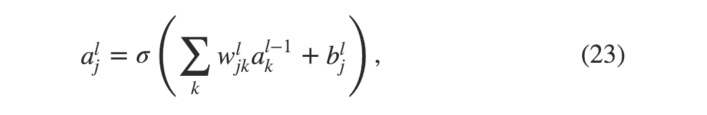

where the sum is over all neurons k in the (l−1)th layer. To rewrite this expression in a matrix form we define a weight matrix wl for each layer, l. The entries of the weight matrix wl are just the weights connecting to the lth layer of neurons, that is, the entry in the jth row and kth column is wljk. Similarly, for each layer l we define a bias vector, bl. You can probably guess how this works - the components of the bias vector are just the values blj, one component for each neuron in the lth layer. And finally, we define an activation vector al whose components are the activations alj.
The last ingredient we need to rewrite (23) in a matrix form is the idea of vectorizing a function such as σ. We met vectorization briefly in the last chapter, but to recap, the idea is that we want to apply a function such as σ to every element in a vector v. We use the obvious notation σ(v) to denote this kind of elementwise application of a function. That is, the components of σ(v) are just σ(v)j=σ(vj). As an example, if we have the function f(x)=x2 then the vectorized form of f has the effect

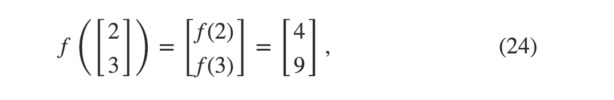

that is, the vectorized f just squares every element of the vector.

With these notations in mind, Equation (23) can be rewritten in the beautiful and compact vectorized form


This expression gives us a much more global way of thinking about how the activations in one layer relate to activations in the previous layer: we just apply the weight matrix to the activations, then add the bias vector, and finally apply the σ function.That global view is often easier and more succinct (and involves fewer indices!) than the neuron-by-neuron view we've taken to now. Think of it as a way of escaping index hell, while remaining precise about what's going on. The expression is also useful in practice, because most matrix libraries provide fast ways of implementing matrix multiplication, vector addition, and vectorization. Indeed, the code in the last chapter made implicit use of this expression to compute the behaviour of the network.

When using Equation (25) to compute al, we compute the intermediate quantity zl≡wlal−1+bl along the way. This quantity turns out to be useful enough to be worth naming: we call zl the weighted input to the neurons in layer l. We'll make considerable use of the weighted input zl later in the chapter. Equation (25) is sometimes written in terms of the weighted input, as al=σ(zl). It's also worth noting that zl has components zlj=∑kwljkal−1k+blj, that is, zlj is just the weighted input to the activation function for neuron j in layer l.

## The two assumptions we need about the cost function
The goal of backpropagation is to compute the partial derivatives ∂C/∂w and ∂C/∂b of the cost function C with respect to any weight w or bias b in the network. For backpropagation to work we need to make two main assumptions about the form of the cost function. Before stating those assumptions, though, it's useful to have an example cost function in mind. We'll use the quadratic cost function from last chapter (c.f. Equation (6)). In the notation of the last section, the quadratic cost has the form

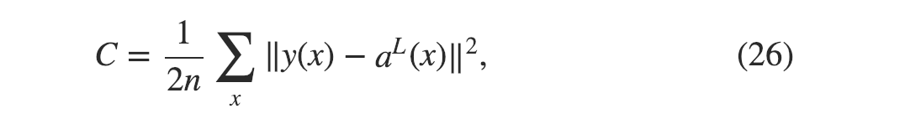

where: n is the total number of training examples; the sum is over individual training examples, x; y=y(x) is the corresponding desired output; L denotes the number of layers in the network; and aL=aL(x) is the vector of activations output from the network when x is input.

Okay, so what assumptions do we need to make about our cost function, C, in order that backpropagation can be applied? The first assumption we need is that the cost function can be written as an average C=1n∑xCx over cost functions Cx for individual training examples, x. This is the case for the quadratic cost function, where the cost for a single training example is Cx=12‖y−aL‖2. This assumption will also hold true for all the other cost functions we'll meet in this book.

The reason we need this assumption is because what backpropagation actually lets us do is compute the partial derivatives ∂Cx/∂w and ∂Cx/∂b for a single training example. We then recover ∂C/∂w and ∂C/∂b by averaging over training examples. In fact, with this assumption in mind, we'll suppose the training example x has been fixed, and drop the x subscript, writing the cost Cx as C. We'll eventually put the x back in, but for now it's a notational nuisance that is better left implicit.

The second assumption we make about the cost is that it can be written as a function of the outputs from the neural network:


For example, the quadratic cost function satisfies this requirement, since the quadratic cost for a single training example x may be written as

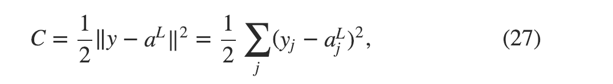

and thus is a function of the output activations. Of course, this cost function also depends on the desired output y, and you may wonder why we're not regarding the cost also as a function of y. Remember, though, that the input training example x is fixed, and so the output y is also a fixed parameter. In particular, it's not something we can modify by changing the weights and biases in any way, i.e., it's not something which the neural network learns. And so it makes sense to regard C as a function of the output activations aL alone, with y merely a parameter that helps define that function.

## The Hadamard product, s⊙t
The backpropagation algorithm is based on common linear algebraic operations - things like vector addition, multiplying a vector by a matrix, and so on. But one of the operations is a little less commonly used. In particular, suppose s and t are two vectors of the same dimension. Then we use s⊙t to denote the elementwise product of the two vectors. Thus the components of s⊙t are just (s⊙t)j=sjtj. As an example,

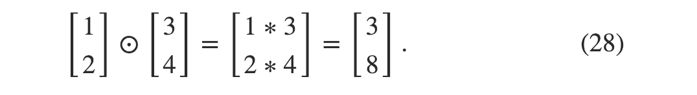

This kind of elementwise multiplication is sometimes called the Hadamard product or Schur product. We'll refer to it as the Hadamard product. Good matrix libraries usually provide fast implementations of the Hadamard product, and that comes in handy when implementing backpropagation.

## The four fundamental equations behind backpropagation
Backpropagation is about understanding how changing the weights and biases in a network changes the cost function. Ultimately, this means computing the partial derivatives ∂C/∂wljk and ∂C/∂blj. But to compute those, we first introduce an intermediate quantity, δlj, which we call the error in the jth neuron in the lth layer. Backpropagation will give us a procedure to compute the error δlj, and then will relate δlj to ∂C/∂wljk and ∂C/∂blj.

To understand how the error is defined, imagine there is a demon in our neural network:


The demon sits at the jth neuron in layer l. As the input to the neuron comes in, the demon messes with the neuron's operation. It adds a little change Δzlj to the neuron's weighted input, so that instead of outputting σ(zlj), the neuron instead outputs σ(zlj+Δzlj). This change propagates through later layers in the network, finally causing the overall cost to change by an amount ∂C∂zljΔzlj.
Now, this demon is a good demon, and is trying to help you improve the cost, i.e., they're trying to find a Δzlj which makes the cost smaller. Suppose ∂C∂zlj has a large value (either positive or negative). Then the demon can lower the cost quite a bit by choosing Δzlj to have the opposite sign to ∂C∂zlj. By contrast, if ∂C∂zlj is close to zero, then the demon can't improve the cost much at all by perturbing the weighted input zlj. So far as the demon can tell, the neuron is already pretty near optimal.And so there's a heuristic sense in which ∂C∂zlj is a measure of the error in the neuron.

Motivated by this story, we define the error δlj of neuron j in layer l by

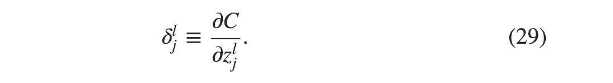

As per our usual conventions, we use δl to denote the vector of errors associated with layer l. Backpropagation will give us a way of computing δl for every layer, and then relating those errors to the quantities of real interest, ∂C/∂wljk and ∂C/∂blj.

You might wonder why the demon is changing the weighted input zlj. Surely it'd be more natural to imagine the demon changing the output activation alj, with the result that we'd be using ∂C∂alj as our measure of error. In fact, if you do this things work out quite similarly to the discussion below. But it turns out to make the presentation of backpropagation a little more algebraically complicated. So we'll stick with δlj=∂C∂zlj as our measure of error.

Plan of attack: Backpropagation is based around four fundamental equations. Together, those equations give us a way of computing both the error δl and the gradient of the cost function. I state the four equations below. Be warned, though: you shouldn't expect to instantaneously assimilate the equations. Such an expectation will lead to disappointment. In fact, the backpropagation equations are so rich that understanding them well requires considerable time and patience as you gradually delve deeper into the equations. The good news is that such patience is repaid many times over. And so the discussion in this section is merely a beginning, helping you on the way to a thorough understanding of the equations.

Here's a preview of the ways we'll delve more deeply into the equations later in the chapter: I'll give a short proof of the equations, which helps explain why they are true; we'll restate the equations in algorithmic form as pseudocode, and see how the pseudocode can be implemented as real, running Python code; and, in the final section of the chapter, we'll develop an intuitive picture of what the backpropagation equations mean, and how someone might discover them from scratch. Along the way we'll return repeatedly to the four fundamental equations, and as you deepen your understanding those equations will come to seem comfortable and, perhaps, even beautiful and natural.

An equation for the error in the output layer, δL: The components of δL are given by

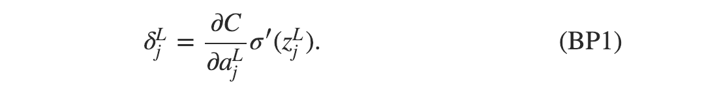

This is a very natural expression. The first term on the right, ∂C/∂aLj, just measures how fast the cost is changing as a function of the jth output activation. If, for example, C doesn't depend much on a particular output neuron, j, then δLj will be small, which is what we'd expect. The second term on the right, σ′(zLj), measures how fast the activation function σ is changing at zLj.

Notice that everything in (BP1) is easily computed. In particular, we compute zLj while computing the behaviour of the network, and it's only a small additional overhead to compute σ′(zLj). The exact form of ∂C/∂aLj will, of course, depend on the form of the cost function. However, provided the cost function is known there should be little trouble computing ∂C/∂aLj. For example, if we're using the quadratic cost function then C=12∑j(yj−aLj)2, and so ∂C/∂aLj=(aLj−yj), which obviously is easily computable.

Equation (BP1) is a componentwise expression for δL. It's a perfectly good expression, but not the matrix-based form we want for backpropagation. However, it's easy to rewrite the equation in a matrix-based form, as

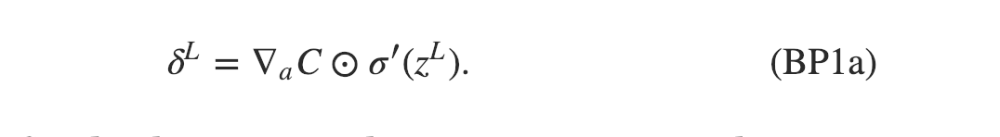

Here, ∇aC is defined to be a vector whose components are the partial derivatives ∂C/∂aLj. You can think of ∇aC as expressing the rate of change of C with respect to the output activations. It's easy to see that Equations (BP1a) and (BP1) are equivalent, and for that reason from now on we'll use (BP1) interchangeably to refer to both equations. As an example, in the case of the quadratic cost we have ∇aC=(aL−y), and so the fully matrix-based form of (BP1) becomes

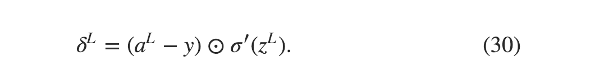

As you can see, everything in this expression has a nice vector form, and is easily computed using a library such as Numpy.

An equation for the error δl in terms of the error in the next layer, δl+1: In particular

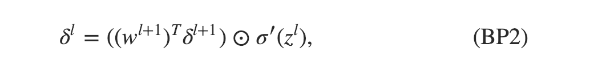

where (wl+1)T is the transpose of the weight matrix wl+1 for the (l+1)th layer. This equation appears complicated, but each element has a nice interpretation. Suppose we know the error δl+1 at the l+1th layer. When we apply the transpose weight matrix, (wl+1)T, we can think intuitively of this as moving the error backward through the network, giving us some sort of measure of the error at the output of the lth layer. We then take the Hadamard product ⊙σ′(zl). This moves the error backward through the activation function in layer l, giving us the error δl in the weighted input to layer l.

By combining (BP2) with (BP1) we can compute the error δl for any layer in the network. We start by using (BP1) to compute δL, then apply Equation (BP2) to compute δL−1, then Equation (BP2) again to compute δL−2, and so on, all the way back through the network.

An equation for the rate of change of the cost with respect to any bias in the network: In particular:

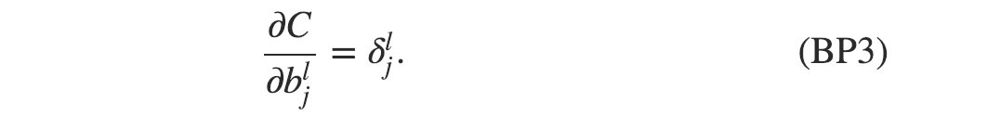

That is, the error δlj is exactly equal to the rate of change ∂C/∂blj. This is great news, since (BP1) and (BP2) have already told us how to compute δlj. We can rewrite (BP3) in shorthand as

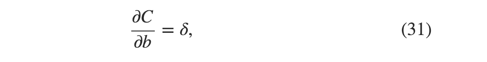

where it is understood that δ is being evaluated at the same neuron as the bias b.

An equation for the rate of change of the cost with respect to any weight in the network: In particular:

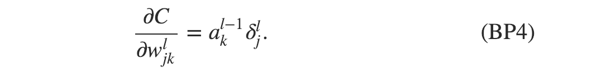

This tells us how to compute the partial derivatives ∂C/∂wljk in terms of the quantities δl and al−1, which we already know how to compute. The equation can be rewritten in a less index-heavy notation as

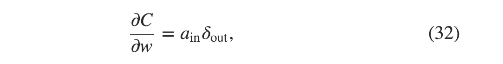

where it's understood that ain is the activation of the neuron input to the weight w, and δout is the error of the neuron output from the weight w. Zooming in to look at just the weight w, and the two neurons connected by that weight, we can depict this as:


A nice consequence of Equation (32) is that when the activation ain is small, ain≈0, the gradient term ∂C/∂w will also tend to be small. In this case, we'll say the weight learns slowly, meaning that it's not changing much during gradient descent. In other words, one consequence of (BP4) is that weights output from low-activation neurons learn slowly.

There are other insights along these lines which can be obtained from (BP1)-(BP4). Let's start by looking at the output layer. Consider the term σ′(zLj) in (BP1). Recall from the graph of the sigmoid function in the last chapter that the σ function becomes very flat when σ(zLj) is approximately 0 or 1. When this occurs we will have σ′(zLj)≈0. And so the lesson is that a weight in the final layer will learn slowly if the output neuron is either low activation (≈0) or high activation (≈1). In this case it's common to say the output neuron has saturated and, as a result, the weight has stopped learning (or is learning slowly). Similar remarks hold also for the biases of output neuron.

We can obtain similar insights for earlier layers. In particular, note the σ′(zl) term in (BP2). This means that δlj is likely to get small if the neuron is near saturation. And this, in turn, means that any weights input to a saturated neuron will learn slowly.

Summing up, we've learnt that a weight will learn slowly if either the input neuron is low-activation, or if the output neuron has saturated, i.e., is either high- or low-activation.

None of these observations is too greatly surprising. Still, they help improve our mental model of what's going on as a neural network learns. Furthermore, we can turn this type of reasoning around. The four fundamental equations turn out to hold for any activation function, not just the standard sigmoid function (that's because, as we'll see in a moment, the proofs don't use any special properties of σ). And so we can use these equations to design activation functions which have particular desired learning properties. As an example to give you the idea, suppose we were to choose a (non-sigmoid) activation function σ so that σ′ is always positive, and never gets close to zero. That would prevent the slow-down of learning that occurs when ordinary sigmoid neurons saturate. Later in the book we'll see examples where this kind of modification is made to the activation function. Keeping the four equations (BP1)-(BP4) in mind can help explain why such modifications are tried, and what impact they can have.


### Problem
Alternate presentation of the equations of backpropagation: I've stated the equations of backpropagation (notably (BP1) and (BP2)) using the Hadamard product. This presentation may be disconcerting if you're unused to the Hadamard product. There's an alternative approach, based on conventional matrix multiplication, which some readers may find enlightening. (1) Show that (BP1) may be rewritten as


where Σ′(zL) is a square matrix whose diagonal entries are the values σ′(zLj), and whose off-diagonal entries are zero. Note that this matrix acts on ∇aC by conventional matrix multiplication. (2) Show that (BP2) may be rewritten as


(3) By combining observations (1) and (2) show that

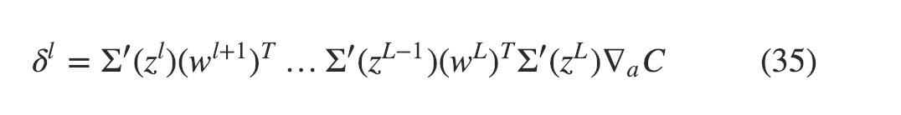

For readers comfortable with matrix multiplication this equation may be easier to understand than (BP1) and (BP2). The reason I've focused on (BP1) and (BP2) is because that approach turns out to be faster to implement numerically.

## Proof of the four fundamental equations (optional)

We'll now prove the four fundamental equations (BP1)-(BP4). All four are consequences of the chain rule from multivariable calculus. If you're comfortable with the chain rule, then I strongly encourage you to attempt the derivation yourself before reading on.

Let's begin with Equation (BP1), which gives an expression for the output error, δL. To prove this equation, recall that by definition.

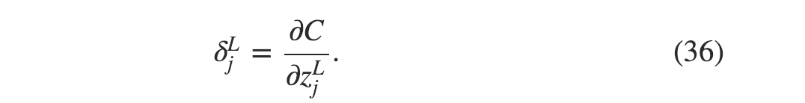

Applying the chain rule, we can re-express the partial derivative above in terms of partial derivatives with respect to the output activations,

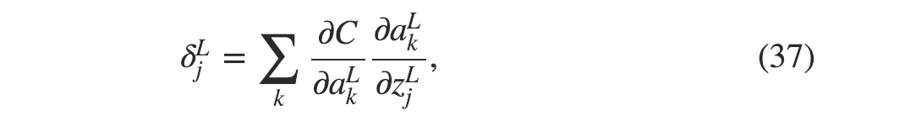

where the sum is over all neurons k in the output layer. Of course, the output activation aLk of the kth neuron depends only on the weighted input zLj for the jth neuron when k=j. And so ∂aLk/∂zLj vanishes when k≠j. As a result we can simplify the previous equation to

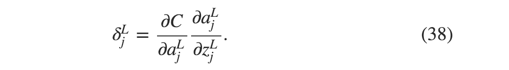

Recalling that aLj=σ(zLj) the second term on the right can be written as σ′(zLj), and the equation becomes

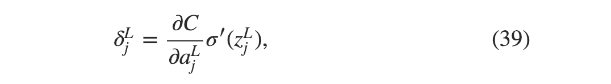

which is just (BP1), in component form.

Next, we'll prove (BP2), which gives an equation for the error δl in terms of the error in the next layer, δl+1. To do this, we want to rewrite δlj=∂C/∂zlj in terms of δl+1k=∂C/∂zl+1k. We can do this using the chain rule,

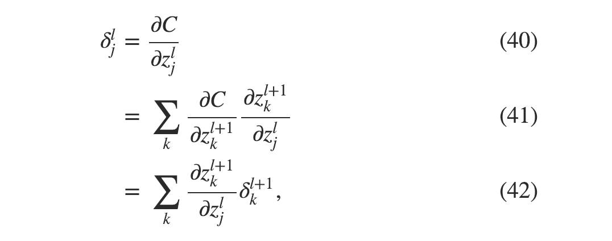

where in the last line we have interchanged the two terms on the right-hand side, and substituted the definition of δl+1k. To evaluate the first term on the last line, note that

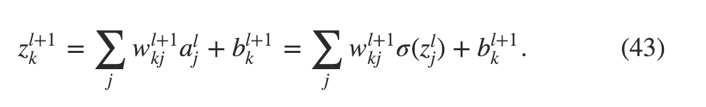

Differentiating, we obtain

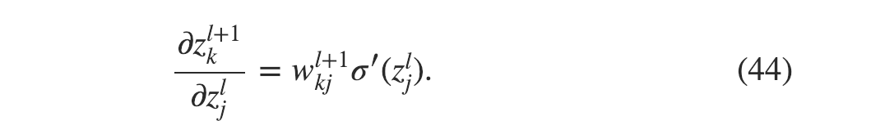

Substituting back into (42) we obtain


This is just (BP2) written in component form.

The final two equations we want to prove are (BP3) and (BP4). These also follow from the chain rule, in a manner similar to the proofs of the two equations above. I leave them to you as an exercise.

That completes the proof of the four fundamental equations of backpropagation. The proof may seem complicated. But it's really just the outcome of carefully applying the chain rule. A little less succinctly, we can think of backpropagation as a way of computing the gradient of the cost function by systematically applying the chain rule from multi-variable calculus. That's all there really is to backpropagation - the rest is details.

## The backpropagation algorithm

The backpropagation equations provide us with a way of computing the gradient of the cost function. Let's explicitly write this out in the form of an algorithm:

    Input x: Set the corresponding activation a1 for the input layer.
    Feedforward: For each l=2,3,…,L compute zl=wlal−1+bl and al=σ(zl).
    Output error δL: Compute the vector δL=∇aC⊙σ′(zL).
    Backpropagate the error: For each l=L−1,L−2,…,2 compute δl=((wl+1)Tδl+1)⊙σ′(zl).
    Output: The gradient of the cost function is given by ∂C∂wljk=al−1kδlj and ∂C∂blj=δlj.

Examining the algorithm you can see why it's called backpropagation. We compute the error vectors δl backward, starting from the final layer. It may seem peculiar that we're going through the network backward. But if you think about the proof of backpropagation, the backward movement is a consequence of the fact that the cost is a function of outputs from the network. To understand how the cost varies with earlier weights and biases we need to repeatedly apply the chain rule, working backward through the layers to obtain usable expressions.

As I've described it above, the backpropagation algorithm computes the gradient of the cost function for a single training example, C=Cx. In practice, it's common to combine backpropagation with a learning algorithm such as stochastic gradient descent, in which we compute the gradient for many training examples. In particular, given a mini-batch of m training examples, the following algorithm applies a gradient descent learning step based on that mini-batch:

    Input a set of training examples
    For each training example x: Set the corresponding input activation ax,1, and perform the following steps:
        Feedforward: For each l=2,3,…,L compute zx,l=wlax,l−1+bl and ax,l=σ(zx,l).
        Output error δx,L: Compute the vector δx,L=∇aCx⊙σ′(zx,L).
        Backpropagate the error: For each l=L−1,L−2,…,2 compute δx,l=((wl+1)Tδx,l+1)⊙σ′(zx,l).
    Gradient descent: For each l=L,L−1,…,2 update the weights according to the rule wl→wl−ηm∑xδx,l(ax,l−1)T, and the biases according to the rule bl→bl−ηm∑xδx,l.

Of course, to implement stochastic gradient descent in practice you also need an outer loop generating mini-batches of training examples, and an outer loop stepping through multiple epochs of training. I've omitted those for simplicity.

## The code for backpropagation

Having understood backpropagation in the abstract, we can now understand the code used in the last chapter to implement backpropagation. Recall from that chapter that the code was contained in the update_mini_batch and backprop methods of the Network class. The code for these methods is a direct translation of the algorithm described above. In particular, the update_mini_batch method updates the Network's weights and biases by computing the gradient for the current mini_batch of training examples:

```
class Network(object):
...
    def update_mini_batch(self, mini_batch, eta):
        """Update the network's weights and biases by applying
        gradient descent using backpropagation to a single mini batch.
        The "mini_batch" is a list of tuples "(x, y)", and "eta"
        is the learning rate."""
        nabla_b = [np.zeros(b.shape) for b in self.biases]
        nabla_w = [np.zeros(w.shape) for w in self.weights]
        for x, y in mini_batch:
            delta_nabla_b, delta_nabla_w = self.backprop(x, y)
            nabla_b = [nb+dnb for nb, dnb in zip(nabla_b, delta_nabla_b)]
            nabla_w = [nw+dnw for nw, dnw in zip(nabla_w, delta_nabla_w)]
        self.weights = [w-(eta/len(mini_batch))*nw 
                        for w, nw in zip(self.weights, nabla_w)]
        self.biases = [b-(eta/len(mini_batch))*nb 
                       for b, nb in zip(self.biases, nabla_b)]
```

Most of the work is done by the line delta_nabla_b, delta_nabla_w = self.backprop(x, y) which uses the backprop method to figure out the partial derivatives ∂Cx/∂blj and ∂Cx/∂wljk. The backprop method follows the algorithm in the last section closely. There is one small change - we use a slightly different approach to indexing the layers. This change is made to take advantage of a feature of Python, namely the use of negative list indices to count backward from the end of a list, so, e.g., l[-3] is the third last entry in a list l. The code for backprop is below, together with a few helper functions, which are used to compute the σ function, the derivative σ′, and the derivative of the cost function. With these inclusions you should be able to understand the code in a self-contained way. If something's tripping you up, you may find it helpful to consult the original description (and complete listing) of the code.

```
class Network(object):
...
   def backprop(self, x, y):
        """Return a tuple "(nabla_b, nabla_w)" representing the
        gradient for the cost function C_x.  "nabla_b" and
        "nabla_w" are layer-by-layer lists of numpy arrays, similar
        to "self.biases" and "self.weights"."""
        nabla_b = [np.zeros(b.shape) for b in self.biases]
        nabla_w = [np.zeros(w.shape) for w in self.weights]
        # feedforward
        activation = x
        activations = [x] # list to store all the activations, layer by layer
        zs = [] # list to store all the z vectors, layer by layer
        for b, w in zip(self.biases, self.weights):
            z = np.dot(w, activation)+b
            zs.append(z)
            activation = sigmoid(z)
            activations.append(activation)
        # backward pass
        delta = self.cost_derivative(activations[-1], y) * \
            sigmoid_prime(zs[-1])
        nabla_b[-1] = delta
        nabla_w[-1] = np.dot(delta, activations[-2].transpose())
        # Note that the variable l in the loop below is used a little
        # differently to the notation in Chapter 2 of the book.  Here,
        # l = 1 means the last layer of neurons, l = 2 is the
        # second-last layer, and so on.  It's a renumbering of the
        # scheme in the book, used here to take advantage of the fact
        # that Python can use negative indices in lists.
        for l in xrange(2, self.num_layers):
            z = zs[-l]
            sp = sigmoid_prime(z)
            delta = np.dot(self.weights[-l+1].transpose(), delta) * sp
            nabla_b[-l] = delta
            nabla_w[-l] = np.dot(delta, activations[-l-1].transpose())
        return (nabla_b, nabla_w)

...

    def cost_derivative(self, output_activations, y):
        """Return the vector of partial derivatives \partial C_x /
        \partial a for the output activations."""
        return (output_activations-y) 

def sigmoid(z):
    """The sigmoid function."""
    return 1.0/(1.0+np.exp(-z))

def sigmoid_prime(z):
    """Derivative of the sigmoid function."""
    return sigmoid(z)*(1-sigmoid(z))
```

### Problem
Fully matrix-based approach to backpropagation over a mini-batch Our implementation of stochastic gradient descent loops over training examples in a mini-batch. It's possible to modify the backpropagation algorithm so that it computes the gradients for all training examples in a mini-batch simultaneously. The idea is that instead of beginning with a single input vector, x, we can begin with a matrix X=[x1x2…xm] whose columns are the vectors in the mini-batch. We forward-propagate by multiplying by the weight matrices, adding a suitable matrix for the bias terms, and applying the sigmoid function everywhere. We backpropagate along similar lines. Explicitly write out pseudocode for this approach to the backpropagation algorithm. Modify network.py so that it uses this fully matrix-based approach. The advantage of this approach is that it takes full advantage of modern libraries for linear algebra. As a result it can be quite a bit faster than looping over the mini-batch. (On my laptop, for example, the speedup is about a factor of two when run on MNIST classification problems like those we considered in the last chapter.) In practice, all serious libraries for backpropagation use this fully matrix-based approach or some variant.

## In what sense is backpropagation a fast algorithm?
In what sense is backpropagation a fast algorithm? To answer this question, let's consider another approach to computing the gradient. Imagine it's the early days of neural networks research. Maybe it's the 1950s or 1960s, and you're the first person in the world to think of using gradient descent to learn! But to make the idea work you need a way of computing the gradient of the cost function. You think back to your knowledge of calculus, and decide to see if you can use the chain rule to compute the gradient. But after playing around a bit, the algebra looks complicated, and you get discouraged. So you try to find another approach. You decide to regard the cost as a function of the weights C=C(w) alone (we'll get back to the biases in a moment). You number the weights w1,w2,…, and want to compute ∂C/∂wj for some particular weight wj. An obvious way of doing that is to use the approximation

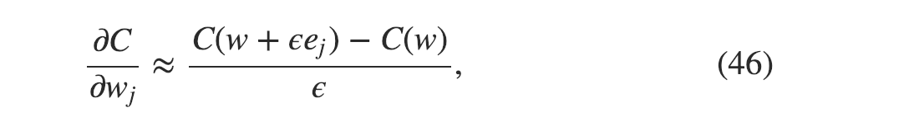

where ϵ>0 is a small positive number, and ej is the unit vector in the jth direction. In other words, we can estimate ∂C/∂wj by computing the cost C for two slightly different values of wj, and then applying Equation (46). The same idea will let us compute the partial derivatives ∂C/∂b with respect to the biases.

This approach looks very promising. It's simple conceptually, and extremely easy to implement, using just a few lines of code. Certainly, it looks much more promising than the idea of using the chain rule to compute the gradient!

Unfortunately, while this approach appears promising, when you implement the code it turns out to be extremely slow. To understand why, imagine we have a million weights in our network. Then for each distinct weight wj we need to compute C(w+ϵej) in order to compute ∂C/∂wj. That means that to compute the gradient we need to compute the cost function a million different times, requiring a million forward passes through the network (per training example). We need to compute C(w) as well, so that's a total of a million and one passes through the network.

What's clever about backpropagation is that it enables us to simultaneously compute all the partial derivatives ∂C/∂wj using just one forward pass through the network, followed by one backward pass through the network. Roughly speaking, the computational cost of the backward pass is about the same as the forward pass.And so the total cost of backpropagation is roughly the same as making just two forward passes through the network. Compare that to the million and one forward passes we needed for the approach based on (46)! And so even though backpropagation appears superficially more complex than the approach based on (46), it's actually much, much faster.

This speedup was first fully appreciated in 1986, and it greatly expanded the range of problems that neural networks could solve. That, in turn, caused a rush of people using neural networks. Of course, backpropagation is not a panacea. Even in the late 1980s people ran up against limits, especially when attempting to use backpropagation to train deep neural networks, i.e., networks with many hidden layers. Later in the book we'll see how modern computers and some clever new ideas now make it possible to use backpropagation to train such deep neural networks.

## Backpropagation: the big picture
As I've explained it, backpropagation presents two mysteries. First, what's the algorithm really doing? We've developed a picture of the error being backpropagated from the output. But can we go any deeper, and build up more intuition about what is going on when we do all these matrix and vector multiplications? The second mystery is how someone could ever have discovered backpropagation in the first place? It's one thing to follow the steps in an algorithm, or even to follow the proof that the algorithm works. But that doesn't mean you understand the problem so well that you could have discovered the algorithm in the first place. Is there a plausible line of reasoning that could have led you to discover the backpropagation algorithm? In this section I'll address both these mysteries.

To improve our intuition about what the algorithm is doing, let's imagine that we've made a small change Δwljk to some weight in the network, wljk:


That change in weight will cause a change in the output activation from the corresponding neuron:


That, in turn, will cause a change in all the activations in the next layer:


Those changes will in turn cause changes in the next layer, and then the next, and so on all the way through to causing a change in the final layer, and then in the cost function:


The change ΔC in the cost is related to the change Δwljk in the weight by the equation


This suggests that a possible approach to computing ∂C∂wljk is to carefully track how a small change in wljk propagates to cause a small change in C. If we can do that, being careful to express everything along the way in terms of easily computable quantities, then we should be able to compute ∂C/∂wljk.
Let's try to carry this out. The change Δwljk causes a small change Δalj in the activation of the jth neuron in the lth layer. This change is given by

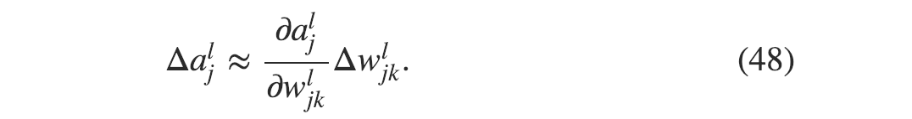

The change in activation Δalj will cause changes in all the activations in the next layer, i.e., the (l+1)th layer. We'll concentrate on the way just a single one of those activations is affected, say al+1q,


In fact, it'll cause the following change:

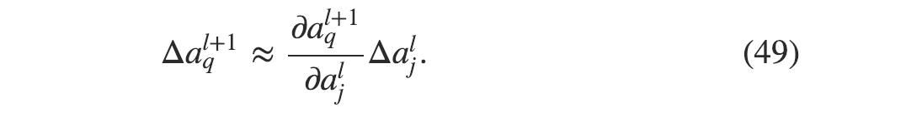

Substituting in the expression from Equation (48), we get:

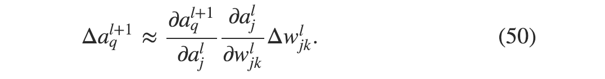

Of course, the change Δal+1q will, in turn, cause changes in the activations in the next layer. In fact, we can imagine a path all the way through the network from wljk to C, with each change in activation causing a change in the next activation, and, finally, a change in the cost at the output. If the path goes through activations alj,al+1q,…,aL−1n,aLm then the resulting expression is

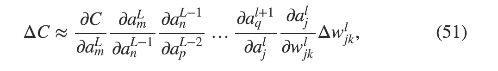

that is, we've picked up a ∂a/∂a type term for each additional neuron we've passed through, as well as the ∂C/∂aLm term at the end. This represents the change in C due to changes in the activations along this particular path through the network. Of course, there's many paths by which a change in wljk can propagate to affect the cost, and we've been considering just a single path. To compute the total change in C it is plausible that we should sum over all the possible paths between the weight and the final cost, i.e.,

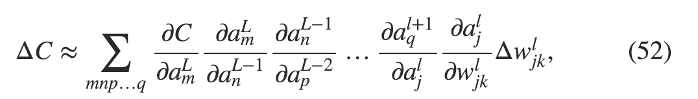

where we've summed over all possible choices for the intermediate neurons along the path. Comparing with (47) we see that

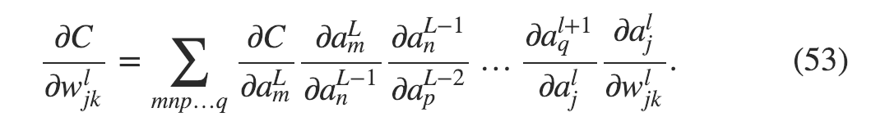

Now, Equation (53) looks complicated. However, it has a nice intuitive interpretation. We're computing the rate of change of C with respect to a weight in the network. What the equation tells us is that every edge between two neurons in the network is associated with a rate factor which is just the partial derivative of one neuron's activation with respect to the other neuron's activation. The edge from the first weight to the first neuron has a rate factor ∂alj/∂wljk. The rate factor for a path is just the product of the rate factors along the path. And the total rate of change ∂C/∂wljk is just the sum of the rate factors of all paths from the initial weight to the final cost. This procedure is illustrated here, for a single path:


What I've been providing up to now is a heuristic argument, a way of thinking about what's going on when you perturb a weight in a network. Let me sketch out a line of thinking you could use to further develop this argument. First, you could derive explicit expressions for all the individual partial derivatives in Equation (53). That's easy to do with a bit of calculus. Having done that, you could then try to figure out how to write all the sums over indices as matrix multiplications. This turns out to be tedious, and requires some persistence, but not extraordinary insight. After doing all this, and then simplifying as much as possible, what you discover is that you end up with exactly the backpropagation algorithm! And so you can think of the backpropagation algorithm as providing a way of computing the sum over the rate factor for all these paths. Or, to put it slightly differently, the backpropagation algorithm is a clever way of keeping track of small perturbations to the weights (and biases) as they propagate through the network, reach the output, and then affect the cost.

Now, I'm not going to work through all this here. It's messy and requires considerable care to work through all the details. If you're up for a challenge, you may enjoy attempting it. And even if not, I hope this line of thinking gives you some insight into what backpropagation is accomplishing.

What about the other mystery - how backpropagation could have been discovered in the first place? In fact, if you follow the approach I just sketched you will discover a proof of backpropagation. Unfortunately, the proof is quite a bit longer and more complicated than the one I described earlier in this chapter. So how was that short (but more mysterious) proof discovered? What you find when you write out all the details of the long proof is that, after the fact, there are several obvious simplifications staring you in the face. You make those simplifications, get a shorter proof, and write that out. And then several more obvious simplifications jump out at you. So you repeat again. The result after a few iterations is the proof we saw earlier - short, but somewhat obscure, because all the signposts to its construction have been removed! I am, of course, asking you to trust me on this, but there really is no great mystery to the origin of the earlier proof. It's just a lot of hard work simplifying the proof I've sketched in this section.

